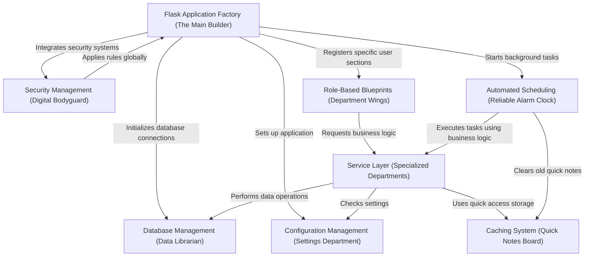

# ManageIt: A Smart Mess Management System

**ManageIt** is an innovative, Flask-based system meticulously crafted to streamline and enhance mess management within educational institutions. Think of it as a digital control center that brings order and efficiency to all mess-related operations.

It empowers various users – students, mess staff, and administrators – with their own tailored dashboards, enabling seamless management of everything from daily menus and payment processing to collecting feedback and tracking waste, all while maintaining top-notch security and performance.

At its heart, ManageIt is designed like a highly organized and efficient company. Each "department" or component has a specific, crucial job, and they all work in perfect sync to deliver a smooth and reliable service.

---

## 🧩 Core Components Overview

Let’s break down the "departments" that make ManageIt so robust:

---

---

### 🏗️ The Main Builder: *Flask Application Factory*

Imagine this as the **chief architect** of the ManageIt system. It’s responsible for bringing all the different parts—like configurations, security measures, and specific user sections—together in the correct order to form a fully functional application.

- Ensures consistent app assembly every time it starts
- Boosts reliability and makes testing easier

---

### ⚙️ The Settings Department: *Configuration Management*

This is like the application’s **recipe book**.

- Manages all flexible settings
- Adapts behavior across development, testing, and production environments
- Handles database locations, secret keys, and debug modes

---

### 📚 The Data Librarian: *Database Management*

Acts as the **dedicated librarian** for the MySQL database.

- Handles storage, retrieval, updates, and deletions
- Uses connection pooling for fast access
- Secures data with input sanitization and transaction management

---

### 🛡️ The Digital Bodyguard: *Security Management*

The **vigilant protector** of ManageIt.

- Manages authentication and secure sessions
- Blocks brute-force attacks
- Validates all incoming user input

---

### 🧠 Specialized Departments: *Service Layer*

These are **expert teams** that handle specific areas of business logic (like Menu or Payment).

- Acts as a middle layer between the frontend and database
- Keeps logic reusable, consistent, and clean

---

### 📝 The Quick Notes Board: *Caching System*

Functions like a **quick-access whiteboard**.

- Stores frequently accessed data like menus for instant retrieval
- Reduces database load
- Improves performance

---

### 🏢 Department Wings: *Role-Based Blueprints*

Imagine the system as a building with distinct **wings** (Student, Admin, Mess Staff).

- Organizes features and routes by user role
- Improves modularity and access control
- Makes code easier to maintain

---

### ⏰ The Reliable Alarm Clock: *Automated Scheduling*

The **automation engine** of ManageIt.

- Handles background tasks like report generation, old data cleanup, and cache clearing
- Executes operations on time without manual intervention
- Enhances efficiency without affecting user experience

---

## 🧠 In Summary

ManageIt is a meticulously designed application composed of interconnected, specialized components that work together to offer:

- Secure, reliable, and efficient mess management
- Clean modular structure for scalability
- A user-friendly experience across all roles

Its architecture ensures it's easy to develop, maintain, and scale for future needs.