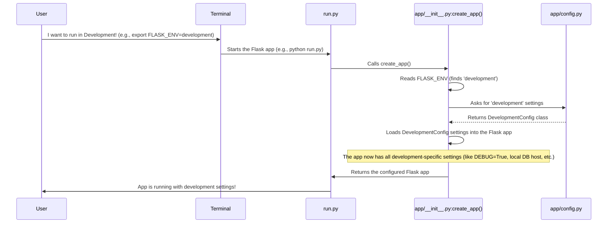

# Chapter 1: Configuration Management (Config)

Imagine you're baking a cake. You have a basic recipe, but depending on the occasion, you might want to adjust it. For a small family dinner, you might use less sugar or a simpler frosting. For a big birthday party, you'd use more sugar, a fancier frosting, and maybe even a different flavor!

In the world of software, our application, `ManageIt`, is like that cake. It needs different "ingredients" or "settings" depending on where it's running:

*   **Development**: When you're building and testing the app on your own computer, you might want to use a simple local database and see lots of helpful debug messages. You don't care much about super strong security yet.
*   **Production**: When the app is live and used by many people, it needs a powerful, secure database. Debug messages should be hidden, and security is *extremely* important.
*   **Testing**: When automated tests are running, you need a completely separate, clean database that gets reset every time, so tests don't interfere with each other.

These different "ingredients" – things like database addresses, secret security keys, email server details, or how strict the security rules are – are called **configurations**. Without a good way to manage them, our app would be a mess! We'd constantly be changing code for each environment, which is slow, error-prone, and risky.

## What is Configuration Management?

**Configuration Management** is all about having a smart way to handle these different settings. It's like having a central control panel for your application where you can flip switches and adjust dials. Instead of changing the core recipe (your code) directly, you just tell the app: "Hey, use the 'production' settings today!"

This approach ensures:
1.  **Correctness**: The app behaves exactly as expected in each environment.
2.  **Security**: Sensitive information (like passwords or API keys) isn't hardcoded into your main program files.
3.  **Flexibility**: You can easily switch between environments without touching the main code.
4.  **Consistency**: Everyone working on the project uses the same set of standard settings for each environment.

## Our Use Case: Running `ManageIt` in Different Environments

Let's say you want to run `ManageIt` on your local computer to add a new feature (development), but your teammate wants to deploy it to the live server (production). Both need to use different settings. How do we tell `ManageIt` which "flavor" of settings to use?

`ManageIt` uses a common and effective strategy for this: **Environment Variables** and **Configuration Classes**.

### Key Concepts for Beginners

1.  **Environment Variables**: Think of these as little sticky notes attached to your computer's operating system (like Windows, macOS, or Linux). They store simple pieces of information, like `FLASK_ENV=development` or `DB_HOST=localhost`. Our application can read these notes to get instructions without them being part of the code itself. This is especially good for sensitive data, as the code doesn't directly contain the secret.

2.  **Configuration Classes**: In `ManageIt`, we have special Python files (`app/config.py`) that act like different versions of our "recipe book." Each version (e.g., `DevelopmentConfig`, `ProductionConfig`) contains a collection of settings tailored for a specific environment. They can even build upon a basic set of rules.

3.  **Loading Configuration**: When `ManageIt` starts, it first checks a special environment variable, usually `FLASK_ENV`. Based on its value (e.g., `development`, `production`, `testing`), the app knows which "recipe book" (configuration class) to load.

## How `ManageIt` Uses Configuration Management

Let's see how `ManageIt` uses this to solve our problem of different settings for different environments.

### Step 1: Telling Your Computer the Environment

Before you run the `ManageIt` application, you tell your computer which environment you want to use. This is done by setting an **environment variable** named `FLASK_ENV`.

For example, to run the app in `development` mode:

```bash
export FLASK_ENV=development
```

Or for `production`:

```bash
export FLASK_ENV=production
```

This command simply creates a temporary sticky note for your current session, telling any program launched from this session that `FLASK_ENV` is set to `development` (or `production`).

### Step 2: Storing Your Secrets Safely

Sensitive information, like database passwords or API keys, should never be hardcoded directly into your Python files. `ManageIt` uses a `.env` file to store these securely.

Here's a simplified look at what a `.env` file might contain (you'll usually have `.env.production` for production settings and potentially just rely on the defaults or command line for development):

```ini
# .env.production (simplified)
SECRET_KEY=your-super-strong-secret-key-here
DB_HOST=your-production-db-host
DB_USER=prod_user
DB_PASSWORD=super_secure_password
MAIL_USERNAME=production@example.com
```

When the application starts, it reads these values from the `.env` file and makes them available as environment variables.

### Step 3: The Application Reads the Settings

Inside `ManageIt`, when the application starts, it looks at the `FLASK_ENV` environment variable you set. Then, it uses this information to pick the correct configuration class.

Here's how you might see the app access a configured setting, like the `SECRET_KEY`:

```python
# Inside your Flask app, after configuration is loaded
# This is how the app would access the SECRET_KEY setting
app.secret_key = app.config['SECRET_KEY']

# The value of app.secret_key would be 'your-super-strong-secret-key-here'
# if 'production' config was loaded.
```

This snippet shows that once the configuration is loaded, your application simply asks for a setting by its name (e.g., `'SECRET_KEY'`) and gets the correct value for the current environment.

## Under the Hood: How `ManageIt` Manages Configuration

Let's peek at the actual files in `ManageIt` that make this possible.

The core of `ManageIt`'s configuration lives in two main places:
1.  **`app/config.py`**: This file defines all the different "recipe books" (configuration classes) for our app.
2.  **`app/__init__.py`**: This file contains the `create_app` function, which is like the "master chef" that reads the `FLASK_ENV` sticky note and picks the right recipe book.

### 1. The Configuration "Recipe Books" (`app/config.py`)

This file contains several Python classes. Each class is a set of rules for a specific environment.

First, `app/config.py` uses a library called `python-dotenv` to load environment variables from a `.env` file. This means the values you put in your `.env` file (like `SECRET_KEY`) become available to your Python code.

```python
# app/config.py (simplified)
import os
from dotenv import load_dotenv

# This line loads variables from your .env file into the environment
load_dotenv()

class Config:
    """Base configuration - common settings for all environments."""
    SECRET_KEY = os.getenv('SECRET_KEY')
    DB_HOST = os.getenv('DB_HOST', 'localhost')
    DEBUG = False # Default to false
    WTF_CSRF_ENABLED = True # Default to enabled

class DevelopmentConfig(Config):
    """Development configuration - specific settings for development."""
    DEBUG = True # We want debug messages when developing
    SESSION_COOKIE_SECURE = False # Don't need HTTPS on local
    WTF_CSRF_ENABLED = True # Re-enable CSRF (as per project's explicit setting)

class ProductionConfig(Config):
    """Production configuration - specific settings for live deployment."""
    DEBUG = False # Never show debug messages in production
    SESSION_COOKIE_SECURE = os.getenv('SESSION_COOKIE_SECURE', 'true').lower() == 'true' # Enforce HTTPS
    HEALTH_TOKEN = os.getenv('HEALTH_TOKEN', 'your_default_secure_token_here') # Health check token

# A dictionary to easily look up the correct config class
config = {
    'development': DevelopmentConfig,
    'production': ProductionConfig,
    'testing': TestingConfig, # (not shown here, but exists for testing)
    'default': DevelopmentConfig
}
```

*   The `Config` class holds settings that are common to *all* environments.
*   `DevelopmentConfig` and `ProductionConfig` **inherit** from `Config`. This means they get all the settings from `Config` *and* can then override or add their own specific settings. For example, `DEBUG` is set to `False` in `Config` (the safe default), but `DevelopmentConfig` overrides it to `True`.

### 2. The "Master Chef" (`app/__init__.py`)

The `create_app` function in `app/__init__.py` is where the magic happens. It's responsible for setting up our Flask application, and part of that setup involves loading the correct configuration.

```python
# app/__init__.py (simplified)
import os
from flask import Flask
from app.config import config # Import our config dictionary

def create_app(config_name=None):
    """Create and configure Flask application."""
    app = Flask(__name__)

    # 1. Figure out which config to use
    if not config_name:
        # Check FLASK_ENV environment variable, default to 'production'
        config_name = os.getenv('FLASK_ENV', 'production')

    # 2. Get the specific configuration class from our 'recipe books'
    cfg_class = config.get(config_name, config['default'])

    # 3. Load all settings from that class into our Flask application
    app.config.from_object(cfg_class)

    # ... other app setup continues ...

    return app
```

Let's visualize this process:



This diagram shows that when you tell your terminal `FLASK_ENV=development`, this information flows through `run.py` to `create_app`. `create_app` then consults `app/config.py` to get the `DevelopmentConfig` class, and finally, applies all those settings to your Flask application.

## Conclusion

Configuration Management is a fundamental concept for building robust applications. Instead of hardcoding settings, `ManageIt` uses environment variables and dedicated configuration classes (`app/config.py`) to adapt its behavior for different scenarios like development, production, and testing. This keeps your code clean, flexible, and secure.

Now that you understand how `ManageIt` gets its settings, let's look at how the application itself is put together, making it easy to grow and maintain.

[Next Chapter: Flask Application Factory](02_flask_application_factory_.md)

---

 <sub><sup>**References**: [[1]](https://github.com/blackpanther093/manage/blob/532c55abf37f53d789a7f0214d35dbff08c6fa09/README.md), [[2]](https://github.com/blackpanther093/manage/blob/532c55abf37f53d789a7f0214d35dbff08c6fa09/app/__init__.py), [[3]](https://github.com/blackpanther093/manage/blob/532c55abf37f53d789a7f0214d35dbff08c6fa09/app/config.py), [[4]](https://github.com/blackpanther093/manage/blob/532c55abf37f53d789a7f0214d35dbff08c6fa09/docker-compose.prod.yml)</sup></sub>