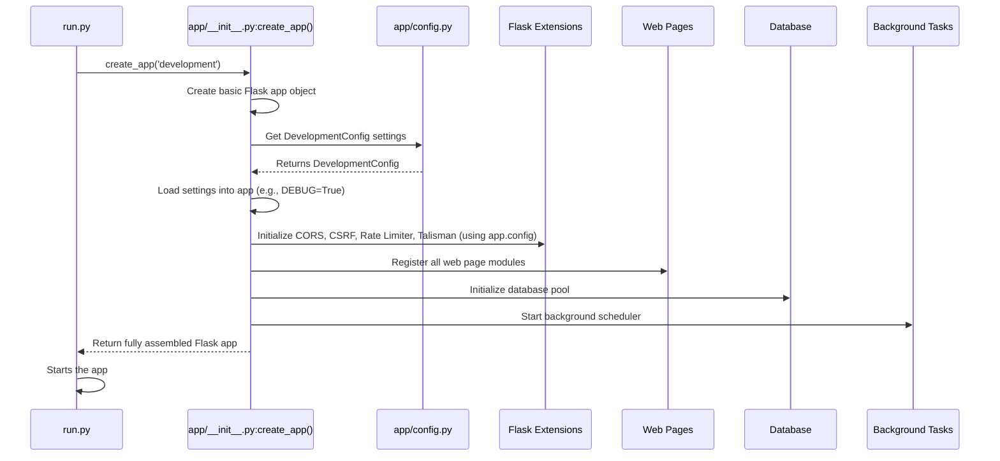

# Chapter 2: Flask Application Factory

In [Chapter 1: Configuration Management (Config)](01_configuration_management__config__.md), we learned how `ManageIt` uses different "recipe books" (configuration settings) for different environments like development, production, or testing. But once we have the recipe, how do we actually *build* the application?

Imagine you're building a car. You have different sets of blueprints and parts depending on whether it's a family car, a sports car, or a truck. You wouldn't just throw all the parts together in a pile. Instead, you'd have an organized **assembly line** where each part is added, connected, and tested in a specific order.

Our `ManageIt` application is similar to a car. It's not just one big piece of code; it's made up of many smaller components:

*   Web pages and forms (blueprints)
*   Database connections
*   Security features (like login, preventing attacks)
*   Background tasks (scheduler)
*   Logging and error handling

Putting all these pieces together in the right way, especially when some parts need to be set up differently for development versus production (as we saw in Chapter 1), can quickly become messy. If all this setup code were scattered everywhere, it would be impossible to understand, maintain, or test.

## What is a Flask Application Factory?

This is where the **Flask Application Factory** pattern comes in. It's like the main assembly line for our `ManageIt` application. Instead of creating the Flask application directly and then adding everything to it one by one in a haphazard way, we use a special function that *builds* and *configures* the entire application for us.

This "factory" function is responsible for:
1.  **Creating the core Flask application instance.**
2.  **Loading the correct configuration** (from Chapter 1).
3.  **Initializing all the different parts** of the application (database, security, web pages, scheduler).
4.  **Connecting everything** so it works together as a complete system.

The main benefit is that we get a clean, ready-to-use Flask application object without worrying about *how* it was put together every time we want to run or test it. We just tell the factory: "Build me a 'development' app!" or "Build me a 'production' app!"

## Our Use Case: Building `ManageIt` for Different Environments

Let's revisit our `ManageIt` application. When you launch `ManageIt`, it needs to:
*   Know which environment it's in (development or production).
*   Load the corresponding settings (e.g., `DEBUG=True` for development, `DEBUG=False` for production).
*   Set up its database connection.
*   Configure its security features.
*   Tell Flask which web pages belong to which parts of the app.
*   Start any background jobs.

The "Flask Application Factory" handles all these steps in an organized way, ensuring that the `ManageIt` application is correctly assembled every time it starts.

## How `ManageIt` Uses the Application Factory

In `ManageIt`, our factory is a function named `create_app()`, located in `app/__init__.py`. This function takes the `config_name` (which we learned about in Chapter 1) and uses it to build a customized Flask application.

### Step 1: Telling the Factory What to Build

When you start `ManageIt`, usually through a small script like `run.py`, it first determines the environment (`development`, `production`, etc.) and then calls the `create_app()` factory function.

Here's how `run.py` uses our factory:

```python
# run.py (simplified)
import os
from app import create_app # Import our factory function!

# Get the environment name (e.g., 'development', 'production')
# This is where the config_name from Chapter 1 comes in!
env = os.getenv('FLASK_CONFIG', os.getenv('FLASK_ENV', 'production'))

# Call the factory to build our app
app = create_app(env)

if __name__ == '__main__':
    # Once the app is built by the factory, we can run it!
    app.run(
        host='0.0.0.0',
        port=int(os.getenv('PORT', 5000)),
        debug=app.config.get('DEBUG', False),
        use_reloader=False
    )
```

**Explanation:**
*   `run.py` first figures out the `env` (environment) using `os.getenv`, just like we discussed in Chapter 1.
*   Then, it calls `create_app(env)`. This is the core of the factory pattern! We're telling the factory: "Build me an application, and use the settings for the `env` environment!"
*   The `create_app` function then does all the heavy lifting and returns a fully configured Flask `app` object.
*   Finally, `run.py` takes that `app` object and starts running it.

## Under the Hood: What Happens Inside the Factory (`create_app`)

Let's peek inside the `create_app` function in `app/__init__.py` to see how it assembles our `ManageIt` application. Think of it as a checklist the factory follows.

### The Assembly Process (Simplified)



### Step-by-Step Code Walkthrough (`app/__init__.py`)

#### 1. Initializing the Flask App and Loading Configuration

The first job of `create_app` is to create the basic Flask application object and load the correct settings, which is exactly what we learned about in [Chapter 1: Configuration Management (Config)](01_configuration_management__config__.md).

```python
# app/__init__.py (simplified)
import os
from flask import Flask
from app.config import Config, config # We need our config dictionary

def create_app(config_name=None):
    """Create and configure Flask application"""
    # Create the core Flask application instance
    app = Flask(__name__, template_folder='templates', static_folder='static')

    # Figure out which configuration to use (e.g., 'development', 'production')
    if not config_name:
        config_name = os.getenv('FLASK_CONFIG', os.getenv('FLASK_ENV', 'production'))

    # Get the specific configuration class from our 'recipe books'
    cfg_class = config.get(config_name, Config)

    # Load all settings from that class into our Flask application
    app.config.from_object(cfg_class)

    # ... more setup will follow ...

    return app
```

**Explanation:**
*   `app = Flask(__name__, ...)` creates the basic Flask app object.
*   The `if not config_name:` block makes sure we always have a `config_name` (like 'development').
*   `cfg_class = config.get(config_name, Config)` retrieves the correct configuration class (e.g., `DevelopmentConfig`) from our `app/config.py` file.
*   `app.config.from_object(cfg_class)` applies all the settings from that class directly to our Flask application. Now `app.config['DEBUG']` will be `True` if `DevelopmentConfig` was loaded!

#### 2. Adding Flask Extensions and Security Features

Next, the factory adds various "plugins" or extensions to our Flask app. These extensions provide extra functionalities like handling Cross-Origin Resource Sharing (CORS), protecting against Cross-Site Request Forgery (CSRF), rate limiting, and setting up advanced security headers. The factory uses the loaded configuration to decide how to set them up.

```python
# app/__init__.py (simplified)
# ... inside create_app, after config is loaded ...
from flask_cors import CORS
from flask_wtf.csrf import CSRFProtect
from flask_limiter import Limiter
# ... other imports ...

    # CORS setup based on environment
    if config_name == 'production':
        CORS(app, origins=['https://manage-lths.onrender.com/'], supports_credentials=True)
    else:
        CORS(app) # More permissive for development

    # CSRF protection (if enabled in config)
    if app.config.get('WTF_CSRF_ENABLED', False):
        CSRFProtect(app)

    # Rate Limiter setup
    Limiter(
        app=app,
        # ... uses app.config for limits and storage ...
    )

    # Talisman for HTTP security headers (production only)
    if config_name == 'production':
        # Talisman(app, force_https=True, ...) # Simplified
        pass # Placeholder for brevity

    # ... more extensions ...
```

**Explanation:**
*   We initialize `CORS`, `CSRFProtect`, and `Limiter` by passing our `app` object to them.
*   Notice how the factory uses `config_name == 'production'` or `app.config.get('WTF_CSRF_ENABLED')` to *conditionally* apply settings. This is crucial for different environments!

#### 3. Registering Blueprints (Organizing Web Pages)

Flask applications are often organized into smaller, modular components called **blueprints**. Each blueprint can handle a specific part of your application (e.g., user authentication, student management, mess management). The factory is responsible for finding all these blueprints and telling the main Flask app about them. This concept will be covered in detail in [Chapter 7: Role-Based Blueprints](07_role_based_blueprints_.md).

```python
# app/__init__.py (simplified)
# ... inside create_app ...
    # Import our blueprints (these are like mini-apps)
    from app.blueprints.auth import auth_bp
    from app.blueprints.student import student_bp
    from app.blueprints.main import main_bp

    # Register them with the main app
    app.register_blueprint(main_bp)
    app.register_blueprint(auth_bp, url_prefix='/auth') # auth pages start with /auth
    app.register_blueprint(student_bp, url_prefix='/student') # student pages start with /student

    # ... other blueprints ...
```

**Explanation:**
*   `from app.blueprints.auth import auth_bp` imports a blueprint object.
*   `app.register_blueprint(auth_bp, url_prefix='/auth')` connects this blueprint to the main app, telling it that all routes defined in `auth_bp` should start with `/auth`.

#### 4. Initializing Database and Scheduler

Finally, the factory takes care of setting up connections to the database and starting any background tasks that need to run regularly. These are critical components that we'll explore in more detail in subsequent chapters: [Chapter 3: Database Management (DatabaseManager)](03_database_management__databasemanager__.md) and [Chapter 8: Automated Scheduling (BackgroundScheduler)](08_automated_scheduling__backgroundscheduler__.md).

```python
# app/__init__.py (simplified)
# ... inside create_app ...
from app.models.database import init_db_pool # Database setup
from app.scheduler import start_scheduler # Scheduler setup

    # Initialize the database connection pool
    with app.app_context(): # 'app_context' is needed for Flask extensions
        init_db_pool()

    # Start the background scheduler
    try:
        start_scheduler(app)
        app.logger.info("Scheduler started successfully.")
    except Exception as e:
        app.logger.error(f"Error starting scheduler: {e}")
        raise # If scheduler fails, the app shouldn't start

    app.logger.info(f"Flask application created with {config_name} configuration")
    return app
```

**Explanation:**
*   `init_db_pool()` sets up our database connections. It needs to run within an `app.app_context()` because it interacts with Flask's internal settings.
*   `start_scheduler(app)` kicks off our background jobs.

## Conclusion

The Flask Application Factory (`create_app` in `app/__init__.py`) is the central nervous system of `ManageIt`. It gracefully handles the complex process of assembling and configuring the entire Flask application, based on the environment settings we discussed in [Chapter 1: Configuration Management (Config)](01_configuration_management__config__.md).

By using this factory pattern, `ManageIt` gains several important benefits:

*   **Organization**: All setup logic is in one well-defined place.
*   **Flexibility**: Easily switch between development, production, or testing configurations.
*   **Testability**: You can create different app instances for testing without affecting your main running app.
*   **Scalability**: As `ManageIt` grows, new features (like more Flask extensions or blueprints) can be added to the factory in an organized manner.

Now that we understand how the `ManageIt` application is built and configured, let's dive into one of its most critical components: managing the database.

[Next Chapter: Database Management (DatabaseManager)](03_database_management__databasemanager__.md)

---

<sub><sup>**References**: [[1]](https://github.com/blackpanther093/manage/blob/532c55abf37f53d789a7f0214d35dbff08c6fa09/DockerFile), [[2]](https://github.com/blackpanther093/manage/blob/532c55abf37f53d789a7f0214d35dbff08c6fa09/app/__init__.py), [[3]](https://github.com/blackpanther093/manage/blob/532c55abf37f53d789a7f0214d35dbff08c6fa09/app/config.py), [[4]](https://github.com/blackpanther093/manage/blob/532c55abf37f53d789a7f0214d35dbff08c6fa09/run.py)</sup></sub>