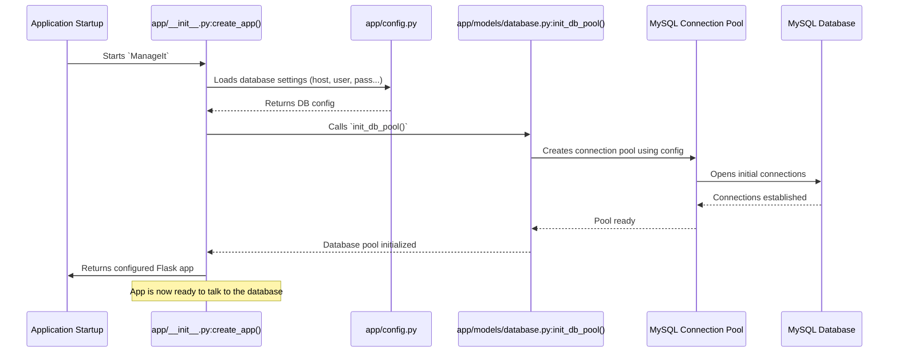

# Chapter 3: Database Management (DatabaseManager)

In [Chapter 1: Configuration Management (Config)](01_configuration_management__config__.md), we set up the "recipe books" for our `ManageIt` application. Then, in [Chapter 2: Flask Application Factory](02_flask_application_factory_.md), we learned how the "master chef" (the factory function) uses these recipes to assemble the entire application. Now, imagine our application as a bustling office. This office needs to keep track of a lot of information: student names, mess bills, payment records, and more. Where does all this important data live?

It lives in a **database**.

Think of the database as a giant, super-organized library filled with countless books (our data). Just like a real library, we need a special person to help us manage these books: finding the right one, adding new ones, updating information, or making sure multiple people can access different books at the same time without causing a mess.

Directly interacting with this powerful database can be tricky. What if someone tries to request a book in a way that breaks the library's system? What if too many people try to access the same shelf at once? What if we forget to put a book back, leading to chaos?

This is where **Database Management** comes in.

## What is Database Management (DatabaseManager)?

In `ManageIt`, the `DatabaseManager` is like our application's dedicated **librarian**. This librarian knows exactly how to:
*   **Access the library securely**: Get connections to the MySQL database without exposing sensitive details.
*   **Manage many visitors**: Handle multiple requests for data efficiently by using a "connection pool" – like having several librarians ready to help.
*   **Find and update books**: Execute queries (requests) to read, add, update, or delete data.
*   **Ensure everything is in order**: Manage "transactions" so that a series of changes to books either all succeed or all fail, preventing half-finished changes.

The `DatabaseManager` makes sure our application interacts with the database reliably, securely, and efficiently, so we don't have to worry about the complex details every time we need data.

## Our Use Case: Getting Student Information

Let's say our `ManageIt` application needs to display the details of a specific student. This involves:
1.  Connecting to the database.
2.  Asking the database for the student's information.
3.  Receiving the information.
4.  Properly closing the connection when done.

The `DatabaseManager` handles all these steps for us, allowing our application code to simply say: "Hey, librarian, give me student 'S123's details!"

## Key Concepts for Beginners

To understand how our `DatabaseManager` works its magic, let's look at its core ideas:

### 1. Database Connection Pool

Imagine our library has a limited number of "borrowing desks" (connections) to serve visitors. Instead of creating a brand new desk every time someone walks in and tearing it down when they leave, we keep a few desks ready and open. When a visitor arrives, they use an available desk. When they're finished, they simply leave the desk, making it available for the next person.

*   **What it is**: A collection of pre-opened database connections.
*   **Why it's useful**:
    *   **Faster**: Reusing existing connections is much quicker than creating new ones every time.
    *   **Efficient**: Prevents the database from being overwhelmed by too many new connection requests.
    *   **Resource Management**: Ensures connections are properly managed and closed.

### 2. Secure Query Execution

When you ask the librarian for a book, you tell them its name. What if you accidentally (or intentionally) say something that confuses the librarian or makes them do something they shouldn't, like giving you a book you're not allowed to see?

*   **What it is**: A safe way to send commands (queries) to the database.
*   **Why it's useful**:
    *   **Prevents SQL Injection**: This is a major security threat where malicious users can insert harmful code into their requests. Secure queries (using "parameterized queries") prevent this by separating the command from the actual data.
    *   **Error Handling**: Catches mistakes and problems gracefully, so the application doesn't crash.

### 3. Transaction Management

If you want to borrow three books, you'd want to make sure you get *all* three, or *none* of them, if something goes wrong (e.g., one book is missing). You don't want to end up with just one or two books and a messy record.

*   **What it is**: A way to group multiple database operations (like adding a student, then adding their initial mess bill) into a single, indivisible unit.
*   **Why it's useful**:
    *   **Data Consistency**: Guarantees that either all changes within the transaction are successfully saved (committed), or if any part fails, all changes are undone (rolled back) as if nothing ever happened. This keeps your data reliable.

### 4. The `get_db_cursor` Context Manager

Our `DatabaseManager` provides a special "borrowing desk" that automatically handles opening and closing your session. You just step up to the desk, do what you need, and when you step away, the desk automatically tidies up and closes your session, even if you forgot something or made a mistake.

*   **What it is**: A special Python feature (`with` statement) that ensures database connections and cursors (tools for executing commands) are always properly opened and, most importantly, *closed*, even if errors occur.
*   **Why it's useful**:
    *   **Resource Safety**: Prevents "connection leaks" (connections staying open forever), which can slow down or crash the application.
    *   **Cleaner Code**: You don't have to write `try...finally` blocks everywhere to manually close connections.

## How `ManageIt` Uses Database Management

Let's see how our application's code uses the `DatabaseManager` to perform common tasks, like getting student details.

### Step 1: Getting a Safe Database Session

Instead of directly asking for a connection, we use the `get_db_cursor` context manager. This sets up everything needed for our database interaction and ensures proper cleanup.

```python
from app.models.database import DatabaseManager

def get_student_name(student_id: str) -> str | None:
    """Fetches a student's name from the database."""
    try:
        # This line uses the 'borrowing desk' (context manager)
        with DatabaseManager.get_db_cursor(dictionary=True) as (cursor, connection):
            # ... now we can execute our query ...
            # ... and safely close the connection later ...
            pass # Placeholder for the query
    except Exception as e:
        print(f"Error fetching student name: {e}")
        return None
```

**Explanation:**
*   `with DatabaseManager.get_db_cursor(dictionary=True) as (cursor, connection):` is like walking up to the special borrowing desk.
    *   `dictionary=True` means results will come back as Python dictionaries (like `{ 's_id': 'S001', 's_name': 'John Doe' }`), which are easy to work with.
    *   `cursor` is our tool to send commands.
    *   `connection` is the actual link to the database.
*   The `with` statement guarantees that when the code inside its block finishes (or runs into an error), the `cursor` and `connection` are automatically closed and returned to the pool.

### Step 2: Executing a Secure Query

Once we have our `cursor` and `connection`, we can execute queries. `DatabaseManager` provides `execute_safe_query` for common operations.

Let's complete our `get_student_name` function:

```python
from app.models.database import DatabaseManager

def get_student_name(student_id: str) -> str | None:
    """Fetches a student's name from the database."""
    # Basic validation for student_id (important for security!)
    if not student_id or not student_id.isalnum() or len(student_id) > 50:
        print("Invalid student ID format.")
        return None

    query = "SELECT s_name FROM student WHERE s_id = %s"
    params = (student_id,) # The student_id is passed separately

    try:
        # Use execute_safe_query for SELECT operations
        result = DatabaseManager.execute_safe_query(
            query, 
            params=params, 
            fetch_one=True, # We expect only one student
            dictionary=True
        )
        if result:
            return result['s_name']
        return None
    except Exception as e:
        print(f"Error fetching student name: {e}")
        return None

# Example Usage:
student_name = get_student_name("S001")
if student_name:
    print(f"Student S001 is: {student_name}") # Output: Student S001 is: John Doe (example)
else:
    print("Student S001 not found or error occurred.")
```

**Explanation:**
*   `query = "SELECT s_name FROM student WHERE s_id = %s"`: Notice the `%s` placeholder. This is how we write secure, parameterized queries. We don't put the actual `student_id` directly into the `query` string.
*   `params = (student_id,)`: The actual value for the placeholder is passed as a tuple to `execute_safe_query`. The database connector handles inserting it safely.
*   `fetch_one=True`: Tells `execute_safe_query` that we expect only one row back.
*   If `result` is found, we return the student's name from the dictionary.

### Step 3: Making Changes (INSERT/UPDATE)

For operations that change data, `execute_safe_query` automatically handles committing the changes to the database.

```python
from app.models.database import DatabaseManager

def add_new_student(student_id: str, name: str, email: str) -> int:
    """Adds a new student to the database."""
    # ... (add more robust validation here for ID, name, email) ...

    query = "INSERT INTO student (s_id, s_name, s_email) VALUES (%s, %s, %s)"
    params = (student_id, name, email)

    try:
        # When fetch_one and fetch_all are False, it's an INSERT/UPDATE/DELETE
        # and it returns the number of affected rows.
        affected_rows = DatabaseManager.execute_safe_query(query, params=params)
        print(f"Added {affected_rows} student(s).")
        return affected_rows
    except Exception as e:
        print(f"Error adding new student: {e}")
        return 0

# Example Usage:
add_new_student("S002", "Jane Doe", "jane.doe@example.com") # Output: Added 1 student(s).
```

**Explanation:**
*   Again, we use `%s` placeholders and pass the values in `params`.
*   Since we're not fetching data, `execute_safe_query` will `commit` the changes and return the number of rows affected by the `INSERT`.

## Under the Hood: How `ManageIt` Manages Databases

Let's peek behind the scenes to see how our `DatabaseManager` is actually built.

### The Database Setup Process

When our `ManageIt` application starts up, thanks to the [Flask Application Factory](02_flask_application_factory_.md), it performs a crucial step: initializing the database connection pool.



This diagram shows that during the application's startup, the `create_app` factory uses the configuration settings to set up our connection pool. Once the pool is ready, any part of the application can request a connection from it quickly and safely.

### 1. The Database Configuration "Ingredients" (`app/config.py`)

Just like we saw in [Chapter 1: Configuration Management (Config)](01_configuration_management__config__.md), our database settings are defined in `app/config.py`. These tell the `DatabaseManager` where the library is, who can access it, and with what password.

```python
# app/config.py (simplified)
import os
from dotenv import load_dotenv

load_dotenv() # Loads environment variables from .env file

class Config:
    # ... other settings ...
    
    # Database Configuration
    DB_HOST = os.getenv('DB_HOST', 'localhost')
    DB_USER = os.getenv('DB_USER')
    DB_PASSWORD = os.getenv('DB_PASSWORD')
    DB_NAME = os.getenv('DB_NAME')
    DB_PORT = int(os.getenv('DB_PORT', '3306'))
    
    # SSL Configuration (for secure connections)
    DB_SSL_DISABLED = os.getenv('DB_SSL_DISABLED', 'false').lower() == 'true'
    # ... more SSL settings ...

    if not all([DB_USER, DB_PASSWORD, DB_NAME]):
        raise ValueError("Database configuration incomplete")

class ProductionConfig(Config):
    # ... production specific settings ...
    
    # Production database with connection pooling
    DB_POOL_SIZE = int(os.getenv('DB_POOL_SIZE', '10')) # How many 'borrowing desks'
    DB_POOL_TIMEOUT = int(os.getenv('DB_POOL_TIMEOUT', '30'))
    # ... more pool settings ...
```

**Explanation:**
*   These lines read values like `DB_HOST`, `DB_USER`, `DB_PASSWORD`, `DB_NAME`, and `DB_PORT` from your `.env` file (or provide defaults).
*   `DB_POOL_SIZE` (in `ProductionConfig`) specifies how many connections our pool should keep ready for the database.

### 2. Initializing the Database Pool (`app/models/database.py`)

The actual setup of the connection pool happens in `app/models/database.py`.

```python
# app/models/database.py (simplified)
import mysql.connector
from mysql.connector import pooling # The library for connection pools
from flask import current_app # To access Flask's config

_connection_pool = None # This will hold our global connection pool

def init_db_pool():
    """Initialize the MySQL connection pool."""
    global _connection_pool
    if _connection_pool is None: # Only create if it doesn't exist
        try:
            pool_config = {
                "pool_name": "manageit_pool",
                "pool_size": current_app.config.get('DB_POOL_SIZE', 5), # Use configured pool size
                "host": current_app.config['DB_HOST'],
                "user": current_app.config['DB_USER'],
                "password": current_app.config['DB_PASSWORD'],
                "database": current_app.config['DB_NAME'],
                "port": current_app.config['DB_PORT'],
                "autocommit": False, # We manage transactions manually
                "ssl_disabled": True # Simplified for example
                # ... other database specific settings ...
            }
            # The magic line: creates the connection pool!
            _connection_pool = pooling.MySQLConnectionPool(**pool_config)
            print("MySQL connection pool initialized.")
        except mysql.connector.Error as e:
            print(f"Error creating connection pool: {e}")
            raise # Re-raise error if pool creation fails
```

**Explanation:**
*   `pooling.MySQLConnectionPool(**pool_config)` is the core function call that creates our "borrowing desks" (connection pool). It takes all the database connection details from our `app.config`.
*   `_connection_pool` is a global variable that holds this pool so it can be reused throughout the application.

### 3. The `DatabaseManager` Class (`app/models/database.py`)

The `DatabaseManager` class itself is where all the "librarian" methods are defined.

```python
# app/models/database.py (simplified)
# ... imports and init_db_pool function above ...

class DatabaseManager:
    """Database connection manager with security features."""
    
    @staticmethod
    def get_connection():
        """Get a pooled database connection."""
        global _connection_pool
        if _connection_pool is None:
            init_db_pool() # Initialize if not already done (safety net)
        
        # This gets a connection from the pool
        connection = _connection_pool.get_connection()
        connection.ping(reconnect=True) # Check if connection is alive
        return connection
    
    @staticmethod
    @contextmanager
    def get_db_cursor(dictionary=False):
        """Context manager for database operations."""
        connection = None
        cursor = None
        try:
            connection = DatabaseManager.get_connection() # Get connection from pool
            cursor = connection.cursor(dictionary=dictionary, buffered=True)
            yield cursor, connection # Hand over cursor and connection to 'with' block
        except Exception as e:
            if connection:
                connection.rollback() # Undo changes on error
            raise # Re-raise the error
        finally:
            if cursor:
                cursor.close() # Always close cursor
            if connection:
                connection.close() # Always return connection to pool
    
    @staticmethod
    def execute_safe_query(query: str, params: tuple = None, fetch_one: bool = False, 
                          fetch_all: bool = False, dictionary: bool = False):
        """Execute a query safely."""
        with DatabaseManager.get_db_cursor(dictionary=dictionary) as (cursor, connection):
            cursor.execute(query, params or ()) # Execute with parameters
            
            if fetch_one:
                return cursor.fetchone()
            elif fetch_all:
                return cursor.fetchall()
            else:
                connection.commit() # Commit changes for INSERT/UPDATE/DELETE
                return cursor.rowcount
```

**Explanation:**
*   `get_connection()`: This method is responsible for grabbing an available connection from our `_connection_pool`.
*   `get_db_cursor()`: This is the special "borrowing desk" context manager.
    *   `yield cursor, connection` is the key. It pauses the `get_db_cursor` function, hands over the `cursor` and `connection` to your `with` block, and waits for your block to finish.
    *   The `finally` block is super important: it ensures that `cursor.close()` and `connection.close()` (which returns the connection to the pool) are always called, even if an error happens inside your `with` block. This prevents resource leaks!
*   `execute_safe_query()`: This method wraps common database operations. It uses `get_db_cursor` internally for safety and handles committing changes or fetching results.

### 4. Integration with Flask Application Factory (`app/__init__.py`)

Finally, the [Flask Application Factory](02_flask_application_factory_.md) (our `create_app` function) makes sure `init_db_pool()` is called when the application starts.

```python
# app/__init__.py (simplified)
# ... other imports ...
from app.models.database import init_db_pool # Import our pool initializer

def create_app(config_name=None):
    # ... Flask app creation and config loading ...
    app = Flask(__name__)
    # ... load config ...

    # Initialize the database connection pool
    # The 'app_context' is needed because init_db_pool uses app.config
    with app.app_context(): 
        init_db_pool()

    # ... other app setup continues ...
    return app
```

**Explanation:**
*   `with app.app_context():` is a special Flask feature. It temporarily makes the Flask application available to functions that need to access its configuration (like `DB_HOST` from `app.config`).
*   `init_db_pool()` is called once during startup, setting up the connection pool for the entire application.

## Conclusion

The `DatabaseManager` is a critical component of `ManageIt`, acting as our reliable "librarian" for all database interactions. By centralizing database logic, using connection pooling, secure queries, and transaction management, `DatabaseManager` ensures that our application's data operations are:

*   **Secure**: Protected against common attacks like SQL injection.
*   **Efficient**: Reuses database connections, saving time and resources.
*   **Reliable**: Ensures data consistency through transactions and proper resource cleanup.
*   **Easy to Use**: Provides simple, high-level methods for common database tasks, allowing developers to focus on application logic.

Now that we understand how `ManageIt` securely and efficiently handles its data, let's explore another crucial aspect: how it keeps itself and its users safe.

[Next Chapter: Security Management (SecurityManager)](04_security_management__securitymanager__.md)

---

 <sub><sup>**References**: [[1]](https://github.com/blackpanther093/manage/blob/532c55abf37f53d789a7f0214d35dbff08c6fa09/app/config.py), [[2]](https://github.com/blackpanther093/manage/blob/532c55abf37f53d789a7f0214d35dbff08c6fa09/app/models/database.py), [[3]](https://github.com/blackpanther093/manage/blob/532c55abf37f53d789a7f0214d35dbff08c6fa09/backup.sh), [[4]](https://github.com/blackpanther093/manage/blob/532c55abf37f53d789a7f0214d35dbff08c6fa09/docker-compose.prod.yml)</sup></sub>
