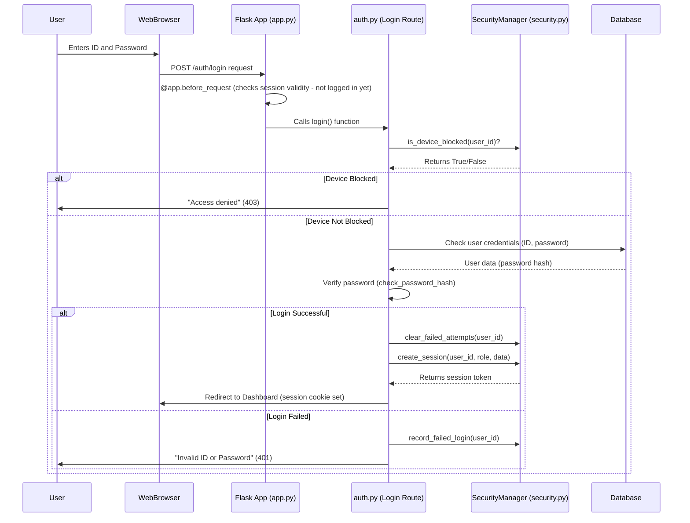

# Chapter 4: Security Management (SecurityManager)

In [Chapter 3: Database Management (DatabaseManager)](03_database_management__databasemanager__.md), we learned how `ManageIt` securely and efficiently handles all its data, like a super-organized library. But imagine that library is holding valuable secrets and treasures. You wouldn't just leave the doors open, would you? You'd need guards, security cameras, and rules to make sure only authorized people get in and no one tries anything suspicious.

Our `ManageIt` application also deals with valuable information: student records, mess bills, login credentials, and more. It needs a digital bodyguard to protect against various online threats. What if someone tries to guess a password repeatedly? What if they try to sneak harmful code into the system? What if they manage to log in and then their session is hijacked?

This is where **Security Management** comes in.

## What is Security Management (SecurityManager)?

In `ManageIt`, the `SecurityManager` component is like the application's **digital bodyguard**. Its job is to vigilantly watch over the entire system, ensuring that everything runs safely and securely. It acts like a skilled security team that:

*   **Checks IDs (User Authentication)**: Makes sure only legitimate users can log in by verifying their identity.
*   **Manages Secure Sessions**: Once you're logged in, it gives you a temporary, secure pass (a "session") and ensures only *you* can use it, and that it doesn't last forever.
*   **Blocks Suspicious Activities**: Detects and stops things like "brute-force" attacks (someone trying hundreds of passwords rapidly) or unusual behavior.
*   **Validates Incoming Data**: Checks all information coming into the application to make sure it's safe and doesn't contain any malicious code.

The `SecurityManager` helps `ManageIt` stay safe from unauthorized access, data breaches, and various online attacks.

## Our Use Case: Secure User Login and Preventing Attacks

Let's consider the most common point of vulnerability: **user login**. When a student or official tries to log into `ManageIt`, we need to:
1.  Verify their identity (authentication).
2.  Make sure they haven't tried to log in too many times (brute-force protection).
3.  Once logged in, give them a secure session.
4.  Continuously ensure that session remains valid and isn't misused.

The `SecurityManager` handles all these critical steps, making the login process robust and secure.

## Key Concepts for Beginners

To understand how our `SecurityManager` acts as a digital bodyguard, let's break down its core ideas:

### 1. Authentication (Who are you?)

This is the process of verifying a user's identity. When you type your ID and password, the `SecurityManager` compares them to the records in the database.

*   **Analogy**: Like showing your ID card to a guard at the entrance.
*   **Why it's important**: Ensures only legitimate users can enter the system.

### 2. Secure Sessions (Keeping you logged in safely)

Once you're authenticated, you don't want to enter your password every time you click a button. A "session" is like a temporary pass issued to you after successful login. The `SecurityManager` creates this pass and tracks it to make sure it's valid, hasn't expired, and is still being used by the original person.

*   **Analogy**: Getting a wristband at a concert – you show it to re-enter without needing your ticket again, but it's only valid for a limited time and only for you.
*   **Why it's important**: Allows seamless navigation for authenticated users while protecting against session hijacking (where someone else tries to steal your "pass").

### 3. Blocking Suspicious Activities (Brute-Force Protection)

Imagine someone standing at the entrance, trying every possible password combination to get in. This is a brute-force attack. The `SecurityManager` observes this behavior.

*   **Analogy**: If a guard sees someone trying to pick the lock repeatedly, they'll step in, maybe block them temporarily or permanently.
*   **Why it's important**: Prevents attackers from continuously guessing passwords and protects user accounts.

### 4. Input Validation (Checking the rules)

Any data that comes into the application (like text typed into a form) could potentially be malicious. Attackers might try to insert harmful code (like "SQL Injection" or "Cross-Site Scripting"). The `SecurityManager` carefully inspects all incoming data.

*   **Analogy**: Like a security scanner at an airport, checking every bag for dangerous items before it enters the secure area.
*   **Why it's important**: Protects the application and its users from various code injection attacks.

## How `ManageIt` Uses Security Management

Let's see how our `ManageIt` application uses the `SecurityManager` to implement these safeguards, especially during login.

### Step 1: Pre-Login Checks (Brute-Force Prevention)

Before even checking the password, the `SecurityManager` performs a quick check to see if the user's device has been blocked due to too many past failed attempts. This happens at the very beginning of the login process.

```python
# app/blueprints/auth.py (simplified login route)
from app.utils.security import security_manager
from flask import request, flash, render_template, current_app

@auth_bp.route('/login', methods=['GET', 'POST'])
def login():
    if request.method == 'POST':
        user_id = request.form.get('id', '').strip()
        # ... (get password, basic validation) ...

        if security_manager.is_device_blocked(user_id):
            current_app.logger.warning(f"Blocked device login attempt for {user_id}")
            flash("Access denied. Too many failed attempts.", 'error')
            return render_template('auth/login.html')

        # ... rest of login logic (database check, password verification) ...
        # ... (code for successful/failed login below) ...
    return render_template('auth/login.html')
```

**Explanation:**
*   `security_manager.is_device_blocked(user_id)` checks if the user's specific device (identified by IP and browser info) is currently on a "blocked list."
*   If `True`, the login attempt is immediately denied, protecting against further brute-force attempts.

### Step 2: Recording Login Attempts and Creating Sessions

After the pre-login check, `ManageIt` verifies the password. Based on the outcome, `SecurityManager` takes further action.

```python
# app/blueprints/auth.py (simplified login route - continued)
# ... inside the POST method of login() ...
        # ... (previous code checking if device is blocked) ...

        # Placeholder for database check for student, mess official, admin
        user_found = False
        password_matches = False

        # Example: Check if student exists and password matches (simplified)
        # In real code, this would involve a database query
        if user_id == "S001" and password == "secret": # DUMMY CHECK
            user_found = True
            password_matches = True
            role = 'student'
            user_name = 'John Doe' # DUMMY DATA

        if user_found and password_matches:
            security_manager.clear_failed_attempts(user_id) # Clear any bad records
            security_manager.create_session(user_id, role, {'user_name': user_name})
            session.update({'user_id': user_id, 'role': role, 'user_name': user_name})
            flash("Logged in successfully!", 'success')
            return redirect(url_for('student.dashboard')) # Redirect to user dashboard
        else:
            security_manager.record_failed_login(user_id) # Record the failed attempt
            flash("Invalid ID or Password.", 'error')

    return render_template('auth/login.html')
```

**Explanation:**
*   If the login is **successful**:
    *   `security_manager.clear_failed_attempts(user_id)` removes any previous warnings for this user/device, giving them a clean slate.
    *   `security_manager.create_session(...)` generates a unique, secure session token for the user and stores important details like their ID and role. This token is then saved in Flask's `session` object.
*   If the login **fails**:
    *   `security_manager.record_failed_login(user_id)` increments a counter for failed attempts from this device. If the count exceeds a limit (e.g., 5 attempts), the device will be added to the `blocked_devices` list.

### Step 3: Validating Sessions Continuously

Once a user is logged in, `ManageIt` needs to ensure their session is still valid *before* processing any new request. This happens automatically for almost every request to the application.

```python
# app/__init__.py (simplified)
from flask import Flask, request, session
from app.utils.security import security_manager # Our bodyguard!

def create_app(config_name=None):
    app = Flask(__name__)
    # ... (app configuration, extensions, blueprints) ...

    # This code runs BEFORE ALMOST EVERY incoming request
    @app.before_request
    def security_before_request():
        if request.endpoint == 'health_check': # Skip for health checks
            return
        
        # Check if the user has a role and if their session is still valid
        if 'role' in session and not security_manager.validate_session():
            session.clear() # If session is invalid, log them out
            return "Session expired", 401 # Deny access

    # ... (other app setup) ...
    return app
```

**Explanation:**
*   The `@app.before_request` is a special Flask function that runs before any view function (like a page route) is called.
*   `security_manager.validate_session()` checks the session token stored in `session['security_token']`. It verifies:
    *   If the token exists and is known.
    *   If the session hasn't timed out (e.g., after 4 hours).
    *   If the user has been inactive for too long (e.g., 2 hours).
    *   (Optionally) If the IP address has changed drastically.
*   If `validate_session()` returns `False` (meaning the session is no longer secure or valid), the user is logged out (`session.clear()`), and denied access (`401 Unauthorized`).

### Step 4: Input Validation for Safety

To protect against malicious input, `SecurityManager` provides a way to check data before it's processed or stored.

```python
# app/blueprints/student.py (simplified - example of form data processing)
from app.utils.security import security_manager
from flask import Blueprint, request, flash, redirect, url_for

student_bp = Blueprint('student', __name__)

@student_bp.route('/update_profile', methods=['POST'])
def update_profile():
    new_name = request.form.get('name', '').strip()
    new_email = request.form.get('email', '').strip()

    # Validate the incoming data before processing it
    is_name_valid, name_msg = security_manager.validate_input(new_name, 'general')
    is_email_valid, email_msg = security_manager.validate_input(new_email, 'email')

    if not is_name_valid:
        flash(f"Invalid name: {name_msg}", 'error')
        return redirect(url_for('student.profile'))
    if not is_email_valid:
        flash(f"Invalid email: {email_msg}", 'error')
        return redirect(url_for('student.profile'))

    # If all inputs are valid, proceed to update the database
    # ... (database update logic here using DatabaseManager) ...
    flash("Profile updated successfully!", 'success')
    return redirect(url_for('student.profile'))
```

**Explanation:**
*   `security_manager.validate_input(data, type)` checks `data` against known harmful patterns or specific format rules (`type='email'` for email format, `type='password'` for password strength, etc.).
*   It returns `True` and "Valid" if safe, or `False` and an error message if suspicious or invalid. This prevents bad data from reaching the database or being displayed in a harmful way.

## Under the Hood: How `ManageIt` Manages Security

Let's take a quick look at how the `SecurityManager` works internally, focusing on its core components.

### The Security Check Process (Simplified Login)



This diagram shows how `SecurityManager` is involved at multiple stages of the login process, acting as a gatekeeper and record-keeper.

### 1. The `SecurityManager` Class (`app/utils/security.py`)

This file contains the `SecurityManager` class, which holds all the logic and data structures for tracking security events.

```python
# app/utils/security.py (simplified)
import time
import hashlib
import logging
import secrets
from typing import Dict, Tuple
from flask import request, session # To get request info and manage Flask session
import re

class SecurityManager:
    def __init__(self):
        self.blocked_devices: Dict[str, float] = {}  # key -> block_timestamp
        self.failed_attempts: Dict[str, Dict] = {}  # key -> {'count': X, 'last_attempt': Y}
        self.session_tokens: Dict[str, Dict] = {} # token -> {'user_id': ..., 'created_at': ...}

        # Basic patterns for input validation
        self.suspicious_patterns = [r'<script', r'javascript:', r'on\w+=']

    def get_client_ip(self) -> str:
        # Get client IP, even if behind proxies
        return request.headers.get('X-Forwarded-For', request.remote_addr) or 'unknown'

    def get_device_fingerprint(self) -> str:
        # Create a unique ID for the device based on browser info
        ua = request.headers.get('User-Agent', '')
        return hashlib.sha256(ua.encode()).hexdigest()[:16] # Short hash

    def is_device_blocked(self, identifier: str = '') -> bool:
        ip = self.get_client_ip()
        device_id = self.get_device_fingerprint()
        device_key = f"{identifier}:{ip}:{device_id}" # Unique key for this user/device
        
        if device_key in self.blocked_devices:
            # Block for 1 hour
            if time.time() - self.blocked_devices[device_key] < 3600:
                return True
            else: # Block expired
                del self.blocked_devices[device_key]
        return False

    def record_failed_login(self, identifier: str) -> bool:
        ip = self.get_client_ip()
        device_id = self.get_device_fingerprint()
        key = f"{identifier}:{ip}:{device_id}"
        current_time = time.time()

        if key not in self.failed_attempts:
            self.failed_attempts[key] = {'count': 0, 'first_attempt': current_time}
        
        self.failed_attempts[key]['count'] += 1
        self.failed_attempts[key]['last_attempt'] = current_time
        
        if self.failed_attempts[key]['count'] >= 5: # 5 failed attempts
            self.blocked_devices[key] = current_time # Block the device
            logging.warning(f"Device blocked for {identifier} after 5 failed logins.")
            return True
        return False

    def clear_failed_attempts(self, identifier: str):
        ip = self.get_client_ip()
        device_id = self.get_device_fingerprint()
        key = f"{identifier}:{ip}:{device_id}"
        self.failed_attempts.pop(key, None) # Remove records
        self.blocked_devices.pop(key, None) # Remove block if any

    def create_session(self, user_id: str, role: str, additional_data: Dict = None) -> str:
        token = secrets.token_urlsafe(32) # Generate a random, secure token
        session_data = {
            'user_id': user_id,
            'role': role,
            'created_at': time.time(),
            'last_activity': time.time(),
            'ip': self.get_client_ip(),
        }
        if additional_data: session_data.update(additional_data)
        
        self.session_tokens[token] = session_data # Store session details
        session['security_token'] = token # Store token in Flask's session cookie
        return token

    def validate_session(self) -> bool:
        token = session.get('security_token')
        if not token or token not in self.session_tokens: return False
        
        s_data = self.session_tokens[token]
        current_time = time.time()
        
        # Session timeout (e.g., 24 hours)
        if current_time - s_data['created_at'] > 86400: # 24 hours
            self.invalidate_session(token)
            return False
        
        # Inactivity timeout (e.g., 2 hours)
        if current_time - s_data['last_activity'] > 7200: # 2 hours
            self.invalidate_session(token)
            return False
        
        s_data['last_activity'] = current_time # Update activity
        return True

    def invalidate_session(self, token: str = None):
        if not token: token = session.get('security_token')
        if token and token in self.session_tokens:
            del self.session_tokens[token] # Remove session from tracking
        session.pop('security_token', None) # Remove token from Flask session

    def validate_input(self, input_data: str, input_type: str = 'general') -> Tuple[bool, str]:
        if not input_data: return True, "Valid"
        
        for pattern in self.suspicious_patterns:
            if re.search(pattern, input_data, re.IGNORECASE):
                return False, "Suspicious pattern detected"
        
        if input_type == 'email' and not re.match(r'[^@]+@[^@]+\.[^@]+', input_data):
            return False, "Invalid email format"
        
        return True, "Valid"

# Create a global instance of our bodyguard!
security_manager = SecurityManager()
```

**Explanation:**
*   The `SecurityManager` class uses Python dictionaries (`blocked_devices`, `failed_attempts`, `session_tokens`) to store information in memory (for this simplified example). In a real production system, some of this might be stored in a faster database like Redis for persistence across application restarts and multiple servers.
*   `get_client_ip()` and `get_device_fingerprint()` try to uniquely identify who is making a request.
*   Methods like `is_device_blocked()`, `record_failed_login()`, `clear_failed_attempts()` work together to implement the brute-force protection logic.
*   `create_session()` and `validate_session()` manage the lifecycle of user sessions.
*   `validate_input()` checks for dangerous patterns or invalid formats in user-provided data.

### 2. Integration with Flask Application Factory (`app/__init__.py`)

As we saw earlier, the [Flask Application Factory](02_flask_application_factory_.md) (our `create_app` function) is where the `SecurityManager` is put to work, especially through special "hooks" that run automatically.

```python
# app/__init__.py (simplified)
from flask import Flask, request, session
from app.utils.security import security_manager # Our global bodyguard instance!

def create_app(config_name=None):
    app = Flask(__name__)
    # ... (app configuration) ...

    # Setup security hooks (functions that run before/after requests)
    @app.before_request
    def security_before_request():
        if request.endpoint == 'health_check': return
        
        identifier = session.get('user_id', '') # Get user ID from session if logged in
        if security_manager.is_device_blocked(identifier):
            return "Access denied", 403 # Block if device is known bad
        
        if 'role' in session and not security_manager.validate_session():
            session.clear() # Clear session and log out
            return "Session expired", 401

    @app.after_request
    def security_after_request(response):
        # Add special security headers to all responses
        # (e.g., preventing clickjacking, enforcing HTTPS)
        response.headers['X-Frame-Options'] = 'DENY'
        response.headers['X-Content-Type-Options'] = 'nosniff'
        # ... more headers from app.config['SECURITY_HEADERS'] ...
        return response

    # ... (register blueprints, initialize database, scheduler) ...
    return app
```

**Explanation:**
*   `security_manager` is imported, and its globally accessible instance is used.
*   `@app.before_request`: This function runs for nearly every incoming request. It's the perfect place for the `SecurityManager` to perform its pre-flight checks:
    *   First, it checks `is_device_blocked` to deny access to known malicious devices.
    *   Then, if a user is logged in (`'role' in session`), it calls `validate_session()` to ensure the session is still active and legitimate.
*   `@app.after_request`: This function runs after a request is processed but before the response is sent back to the user. It's used to add important security headers, like those that protect against common web vulnerabilities.

## Conclusion

The `SecurityManager` is an indispensable "digital bodyguard" for `ManageIt`. By centralizing and automating crucial security tasks like user authentication, session management, brute-force attack prevention, and input validation, it protects the application and its users from a wide range of threats. This allows `ManageIt` to handle sensitive information and user interactions with confidence, knowing that a vigilant security system is always watching.

Now that we understand how `ManageIt` keeps itself safe, let's explore how it separates its business logic from its web presentation.

[Next Chapter: Service Layer](05_service_layer_.md)

---

<sub><sup>**References**: [[1]](https://github.com/blackpanther093/manage/blob/532c55abf37f53d789a7f0214d35dbff08c6fa09/app/__init__.py), [[2]](https://github.com/blackpanther093/manage/blob/532c55abf37f53d789a7f0214d35dbff08c6fa09/app/blueprints/auth.py), [[3]](https://github.com/blackpanther093/manage/blob/532c55abf37f53d789a7f0214d35dbff08c6fa09/app/config.py), [[4]](https://github.com/blackpanther093/manage/blob/532c55abf37f53d789a7f0214d35dbff08c6fa09/app/utils/security.py)</sup></sub>