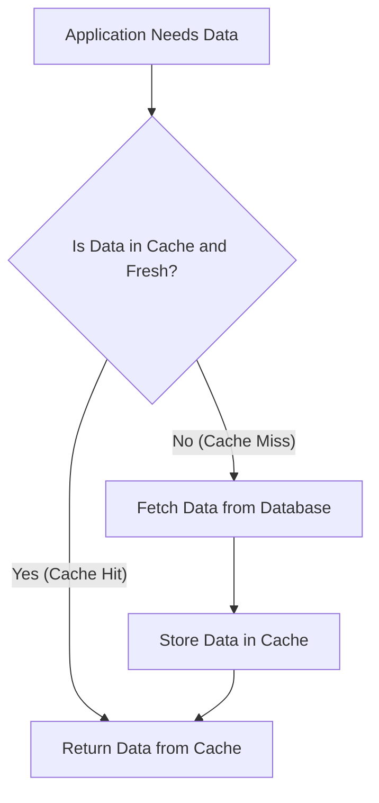
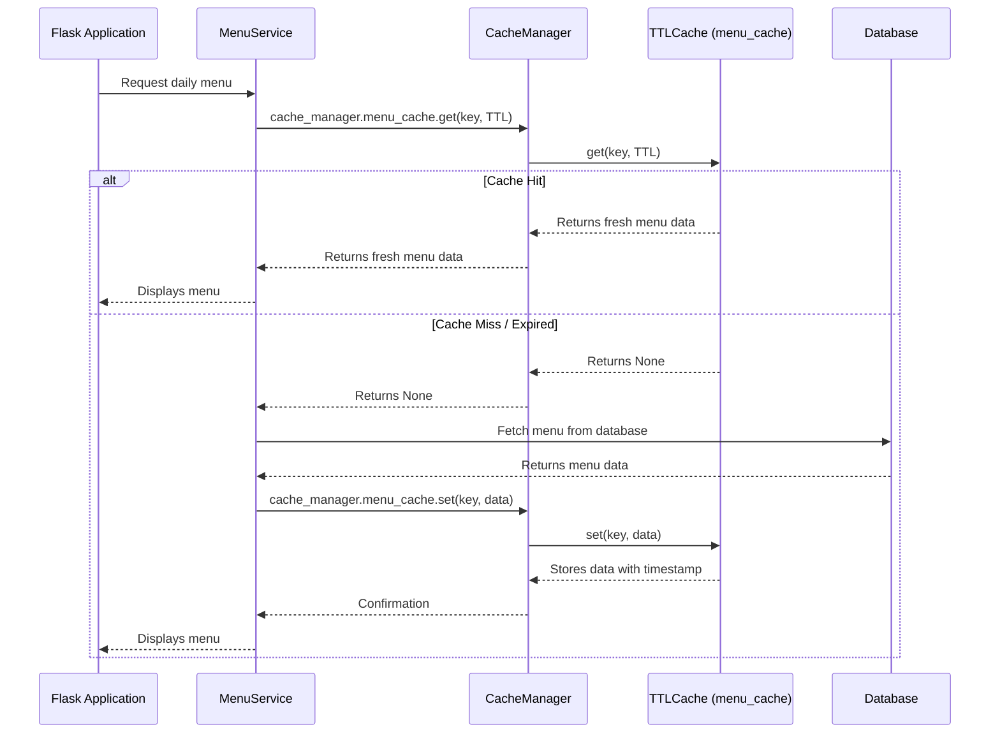

# Chapter 6: Caching System (CacheManager)

In [Chapter 5: Service Layer](05_service_layer_.md), we learned how `ManageIt` organizes its business logic into specialized "departments" (service classes) like `MenuService` to keep our code clean and efficient. We even saw a hint of how `MenuService` might use a "cache" to get menu information faster.

Now, let's explore that "cache" in detail. Imagine our `ManageIt` application is a busy restaurant kitchen. Every time a customer asks for a "daily special," the chef has to either:

1.  **Look it up in a big recipe book (the Database)**: This takes time, as the chef has to flip through pages, find the ingredients, and prepare it from scratch.
2.  **Grab it from a pre-prepared tray (the Cache)**: If the special is very popular, the chef might have a few portions already made and kept warm. This is much faster!

If everyone constantly asked for the same "daily special" and the chef always had to go to the recipe book, things would slow down dramatically. Our application faces a similar challenge: frequently requested data, like the daily menu or average ratings, can cause slow response times if we always fetch it directly from the database.

This is where the **Caching System** comes in.

## What is a Caching System (CacheManager)?

The `CacheManager` in `ManageIt` is like having a team of dedicated assistants in our "kitchen" who:
*   **Anticipate Needs**: They know which information (like the daily menu) is requested most often.
*   **Store Temporarily**: They keep copies of this frequently requested information in a super-fast, temporary storage area (the "cache").
*   **Quick Retrieval**: When the application needs data, it first asks the `CacheManager`. If the data is there and still fresh, it gets it instantly!
*   **Refresh**: They know when the data might be "stale" (outdated) and need to be re-fetched from the main "recipe book" (the database).

This system significantly speeds up the application by reducing the number of slow database queries, just like grabbing a pre-prepared dish is faster than cooking it from scratch.

## Our Use Case: Speeding Up the Daily Menu Retrieval

Let's revisit our student who wants to see today's mess menu. Without caching, every single student who opens the app to check the menu forces `ManageIt` to:
1.  Connect to the database.
2.  Run a query to find the menu items.
3.  Process the results.

If hundreds of students do this within minutes, the database can get overwhelmed, and the app feels slow.

With the `CacheManager`, the process becomes:
1.  **First student**: `MenuService` asks `CacheManager` for the menu. It's not there (**cache miss**). `MenuService` fetches from the database, then tells `CacheManager` to store it.
2.  **Next hundred students**: `MenuService` asks `CacheManager`. It *is* there and fresh (**cache hit**)! `CacheManager` instantly returns the stored menu. No database trip needed!

This makes the app much faster for everyone.

## Key Concepts for Beginners

To understand how `CacheManager` works its magic, let's look at its core ideas:

### 1. What is a Cache?

It's a temporary storage area for data that is likely to be needed again soon. Think of it as a small whiteboard in the kitchen where the chef writes down the most popular orders, so they don't have to check the big recipe book every time.

*   **Benefit**: Makes fetching data incredibly fast, as it avoids slower operations (like talking to a database over the network).

### 2. Time To Live (TTL)

Data in a cache can't stay there forever, because it might become outdated. The "Time To Live" (TTL) is how long the data is considered "fresh" or valid in the cache. Once the TTL expires, the data is considered "stale" and needs to be re-fetched from the original source (the database).

*   **Analogy**: Our chef's pre-prepared dishes have an expiry time. After that, they must be thrown out and made fresh if requested again.
*   **Benefit**: Ensures users always see reasonably up-to-date information. Different types of data might have different TTLs (e.g., daily menu can be cached longer than live stock prices).

### 3. Cache Hit and Cache Miss

These terms describe whether the requested data was found in the cache:

*   **Cache Hit**: When the application asks for data, and it's found in the cache and is still fresh (within its TTL). This is the fast path!
*   **Cache Miss**: When the application asks for data, but it's *not* in the cache, or it's expired. The application then has to go to the slower source (like the database) to get the data, and then it might put a fresh copy into the cache for next time.



## How `ManageIt` Uses the Caching System

Our service classes (from [Chapter 5: Service Layer](05_service_layer_.md)) are the primary users of the `CacheManager`. They decide *when* to try the cache and *when* to go to the database.

Let's look at how the `MenuService` uses the `CacheManager` to get the daily menu:

### Step 1: Trying to Get Data from the Cache

The `MenuService` first asks `cache_manager.menu_cache` if it has the menu for today's meal.

```python
# app/services/menu_service.py (simplified)
from app.utils.cache import cache_manager # Import our CacheManager!
from app.utils.time_utils import TimeUtils

class MenuService:
    @classmethod
    def get_menu(cls, date=None, meal=None):
        current_meal = meal or TimeUtils.get_current_meal()
        cache_key = f"menu_{current_meal}_{date or 'today'}" # Unique ID for this menu

        # 1. Ask the cache for the menu
        cached_data = cache_manager.menu_cache.get(cache_key, cache_manager.MENU_TTL)
        if cached_data:
            print(f"DEBUG: Menu for {current_meal} fetched from CACHE!")
            return cached_data # ✅ Cache Hit! Return immediately
        
        # ... (If not in cache, we'll fetch from DB below) ...
        return None, [], None # Placeholder
```

**Explanation:**
*   `cache_manager` is the central object that holds different caches.
*   `cache_manager.menu_cache` is a specific cache dedicated to menu data.
*   `get(cache_key, cache_manager.MENU_TTL)` attempts to retrieve data using a unique `cache_key`. It also passes the `MENU_TTL` so the cache knows if the stored data is still fresh.
*   If `cached_data` is found and still valid (a **cache hit**), the function returns it right away, saving a trip to the database!

### Step 2: Fetching from Database and Storing in Cache

If the data is *not* in the cache (a **cache miss**), `MenuService` then fetches it from the database and, importantly, tells the `CacheManager` to store it for future requests.

```python
# app/services/menu_service.py (simplified - continued)
# ... inside the get_menu() method ...
        # 1. Try cache (as shown above)
        cached_data = cache_manager.menu_cache.get(cache_key, cache_manager.MENU_TTL)
        if cached_data:
            return cached_data

        # 2. If cache miss, fetch from database
        try:
            # This method would interact with DatabaseManager to get the menu
            meal_name, veg_menu_items, top_rated_item = cls._fetch_menu_from_db(date, current_meal)
            menu_data = (meal_name, veg_menu_items, top_rated_item)

            # 3. Store the freshly fetched data in the cache for next time
            cache_manager.menu_cache.set(cache_key, menu_data)
            print(f"DEBUG: Menu for {current_meal} fetched from DB and CACHED!")
            return menu_data
        except Exception as e:
            # Handle errors
            print(f"Error fetching menu: {e}")
            return None, [], None
```

**Explanation:**
*   `cls._fetch_menu_from_db(...)` (as covered in [Chapter 5: Service Layer](05_service_layer_.md)) is called to get the data from the database.
*   `cache_manager.menu_cache.set(cache_key, menu_data)` then stores this new, fresh data in the cache. The `CacheManager` automatically records the time, so it knows when this entry will expire.

## Under the Hood: How `ManageIt` Builds the Cache

Let's peek behind the scenes to see how our `CacheManager` is built and how it stores data. All the caching logic lives in `app/utils/cache.py`.

### The Caching Workflow (Simplified)



This diagram illustrates how `MenuService` interacts with the `CacheManager`, which then uses a specific `TTLCache` instance (like `menu_cache`) to store and retrieve data. Only if the cache misses does it go to the database.

### 1. The `TTLCache` Class (`app/utils/cache.py`)

This is the core building block for any cache in `ManageIt`. It's a "Time To Live" cache, meaning it automatically handles expiration. It's also "thread-safe," which is important because many parts of our application might try to access or modify the cache at the same time without messing things up.

```python
# app/utils/cache.py (simplified)
import threading
import time
from typing import Any, Optional, Dict, Tuple

class TTLCache:
    def __init__(self):
        # _store: A dictionary to hold our cached items
        # Each item is (value, timestamp_when_it_was_stored)
        self._store: Dict[str, Tuple[Any, float]] = {}
        # _lock: Ensures only one part of the app modifies the cache at a time
        self._lock = threading.RLock()
    
    def get(self, key: str, ttl: float) -> Optional[Any]:
        with self._lock: # Lock the cache to prevent simultaneous access
            value, timestamp = self._store.get(key, (None, 0)) # Get stored data and its timestamp
            
            # Check if the data exists and is still fresh (current time - timestamp < TTL)
            if value is not None and time.time() - timestamp < ttl:
                return value
            
            # If expired or not found, remove it and return None (cache miss)
            self._store.pop(key, None)
            return None
    
    def set(self, key: str, value: Any) -> None:
        with self._lock: # Lock the cache
            self._store[key] = (value, time.time()) # Store value with current time
    
    def clear(self, key: Optional[str] = None) -> None:
        with self._lock: # Lock the cache
            if key:
                self._store.pop(key, None) # Clear a specific item
            else:
                self._store.clear() # Clear everything
```

**Explanation:**
*   `_store`: This is a regular Python dictionary. For each `key` (like "menu_Breakfast_today"), it stores a `tuple` containing the actual `value` (the menu data) and the `timestamp` when it was put into the cache.
*   `_lock`: This is a "thread lock." Imagine a single door to the cache. When one part of the app (a "thread") wants to access the cache, it "locks" the door (`with self._lock:`). No other part can enter until the first one unlocks it. This prevents confusing situations where data might be updated incorrectly.
*   `get(key, ttl)`: Checks the `_store`. If `key` is found, it calculates if `time.time() - timestamp` (how long ago it was stored) is less than `ttl` (how long it should be fresh). If so, it's a **cache hit** and returns the `value`. Otherwise, it's a **cache miss** and returns `None` after removing the stale item.
*   `set(key, value)`: Simply adds or updates `key` in `_store` with the `value` and the `current time`.

### 2. The `CacheManager` Class (`app/utils/cache.py`)

This class acts as the central hub for all the different caches in `ManageIt`. It creates separate `TTLCache` instances for different types of data (menu, ratings, payments, etc.) and defines their specific `TTL` values.

```python
# app/utils/cache.py (simplified - continued)
# ... TTLCache class defined above ...

class CacheManager:
    """Centralized cache manager for the application"""
    
    def __init__(self):
        # Create separate TTLCache instances for different data types
        self.menu_cache = TTLCache()
        self.rating_cache = TTLCache()
        self.non_veg_cache = TTLCache()
        self.payment_cache = TTLCache()
        # ... and so on for other caches ...

        # Define specific TTLs for each type of data (in seconds)
        self.MENU_TTL = 3600  # 1 hour
        self.RATING_TTL = 1800  # 30 minutes
        self.PAYMENT_TTL = 3600  # 1 hour
        self.FEEDBACK_TTL = 86400  # 24 hours
        # ... more TTLs ...

    def clear_all_caches(self):
        """Clear all caches (useful for maintenance or major data changes)"""
        # Iterate through all cache instances and call their clear() method
        for cache in [self.menu_cache, self.rating_cache, self.non_veg_cache,
                     self.payment_cache, self.feedback_cache]: # simplified list
            cache.clear()

# Create a global instance of our CacheManager
cache_manager = CacheManager()
```

**Explanation:**
*   Inside `__init__`, `CacheManager` creates an instance of `TTLCache` for each type of data that needs caching (`self.menu_cache`, `self.rating_cache`, etc.). This keeps related cached data organized.
*   It also defines constants like `self.MENU_TTL` (1 hour) or `self.RATING_TTL` (30 minutes). These are used by the service layers when calling `cache.get()`.
*   `cache_manager = CacheManager()`: This line creates a single, global instance of our `CacheManager`. This means all parts of the application will use the *same* cache instances, so they can share cached data efficiently.

## Conclusion

The `Caching System (CacheManager)` is a powerful tool in `ManageIt` for significantly boosting application performance. By temporarily storing frequently accessed data with a "Time To Live" (TTL), it reduces the load on the database and delivers information much faster to users. This clever use of "cache hits" ensures that common requests are handled with lightning speed, making the application more responsive and efficient.

Now that `ManageIt` is speedy and efficient, let's explore how it gives different users access to different parts of the application based on their roles.

[Next Chapter: Role-Based Blueprints](07_role_based_blueprints_.md)

---

<sub><sup>**References**: [[1]](https://github.com/blackpanther093/manage/blob/532c55abf37f53d789a7f0214d35dbff08c6fa09/app/__init__.py), [[2]](https://github.com/blackpanther093/manage/blob/532c55abf37f53d789a7f0214d35dbff08c6fa09/app/scheduler.py), [[3]](https://github.com/blackpanther093/manage/blob/532c55abf37f53d789a7f0214d35dbff08c6fa09/app/services/menu_service.py), [[4]](https://github.com/blackpanther093/manage/blob/532c55abf37f53d789a7f0214d35dbff08c6fa09/app/services/rating_service.py), [[5]](https://github.com/blackpanther093/manage/blob/532c55abf37f53d789a7f0214d35dbff08c6fa09/app/utils/cache.py)</sup></sub>
