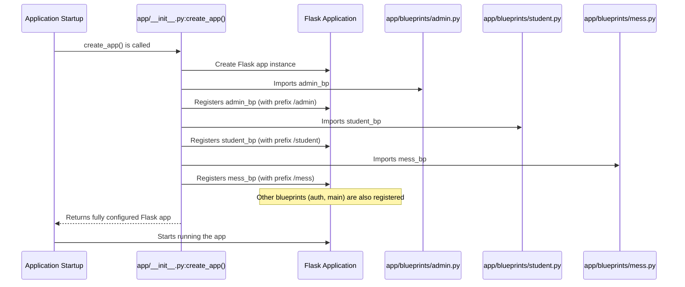

# Chapter 7: Role-Based Blueprints


In [Chapter 6: Caching System (CacheManager)](06_caching_system__cachemanager__.md), we made `ManageIt` super speedy by efficiently storing frequently accessed data. Now that our application is fast and performs its tasks efficiently, we need to think about organizing its different parts.

Imagine our `ManageIt` application is a big school building. This school has various departments:
*   **Administration Department**: Handles overall school management, staff, and policies.
*   **Student Affairs Department**: Deals with student records, attendance, and activities.
*   **Cafeteria Management Department**: Manages the mess menu, waste, and payments.

Each department has its own offices, specific tasks, and only certain people (staff, students, cafeteria officials) are allowed to access them. You wouldn't want a student wandering into the Admin's private files, right?

If we put all the offices and functions for all departments into one giant, messy room, it would be impossible to find anything, manage who accesses what, or add new features without tripping over existing ones. This is the problem we face in software if we don't organize our code:
*   All web pages and features get mixed together.
*   It's hard to tell which part of the app is for students, which is for admins.
*   Controlling access becomes a nightmare.

This is where **Role-Based Blueprints** come in!

## What are Role-Based Blueprints?

**Role-Based Blueprints** are like having separate, organized **wings** or **departments** in our `ManageIt` school building. Each blueprint is a self-contained section of our application designed for a specific **role** (Admin, Student, Mess Staff) or a core function (like Authentication).

Each blueprint manages its own:
*   **Web pages (routes)**: e.g., `/student/dashboard` vs. `/admin/dashboard`.
*   **Related functions**: The logic specific to that role.
*   **Templates**: The HTML files for that section.

This approach makes `ManageIt`:
1.  **Organized**: Code for students stays with students, code for admins stays with admins.
2.  **Modular**: Each part can be developed, understood, and maintained independently.
3.  **Secure**: It's easier to enforce who can access which part of the application.
4.  **Easier to Develop**: New features for students only affect the student blueprint, not the entire app.

## Our Use Case: Showing Different Dashboards for Different Users

Let's say `ManageIt` needs to show a different "dashboard" depending on whether an **Admin**, a **Student**, or a **Mess Staff** logs in.
*   **Student Dashboard**: Shows their mess menu, feedback status, and payment history.
*   **Mess Staff Dashboard**: Shows tools for adding non-veg items, tracking waste, and managing payments.
*   **Admin Dashboard**: Shows overall system toggles, feedback summaries, and waste reports.

Instead of trying to cram all this into one `dashboard.html` and one `/dashboard` route with lots of "if-else" statements, we create separate blueprints for each role.

## Key Concepts for Beginners

To understand how Role-Based Blueprints work, let's look at the main ideas:

### 1. Blueprint (A Mini-Application)

A Flask **Blueprint** is essentially a mini-application that can handle its own routes, templates, and static files. It's not a full Flask application on its own, but it can be registered with a main Flask application. Think of it as a specialized module.

*   **Analogy**: A pre-fabricated office module that you can easily attach to the main school building. It has its own entrance, rooms, and signage, but it's part of the bigger structure.
*   **Benefit**: Keeps related code together and separated from other parts of the app.

### 2. Role-Based Grouping

This means we create blueprints specifically for user roles. So, we'll have:
*   `student_bp`: For all student-related pages and functions.
*   `mess_bp`: For all mess official-related pages and functions.
*   `admin_bp`: For all admin-related pages and functions.
*   `auth_bp`: For common authentication pages like login/signup.
*   `main_bp`: For public pages accessible to everyone (like the home page).

*   **Analogy**: Creating specific "wings" for "Student Affairs," "Administration," and "Cafeteria Management."
*   **Benefit**: Ensures that features meant for one role are not mixed with others, making access control straightforward.

### 3. Registering Blueprints with the Main App

The main Flask application (which we learned about in [Chapter 2: Flask Application Factory](02_flask_application_factory_.md)) needs to know about all these mini-applications. This is done by "registering" them. When a blueprint is registered, you can also specify a `url_prefix`.

*   **Analogy**: The school director officially acknowledges each department and gives them a dedicated section of the building (e.g., "Student Affairs is in the East Wing," "Admin is in the North Wing").
*   **Benefit**: The main app knows which blueprint handles which URL patterns (e.g., `/student/...`, `/admin/...`).

## How `ManageIt` Uses Role-Based Blueprints

In `ManageIt`, we have separate blueprint files for each major role and function, located in the `app/blueprints` directory.

### Step 1: Defining a Blueprint

Each blueprint file starts by creating a `Blueprint` object.

```python
# app/blueprints/student.py (simplified)
from flask import Blueprint, render_template, session, flash, redirect, url_for

# Create a blueprint named 'student'
student_bp = Blueprint('student', __name__)

# A helper function to ensure only students can access student pages
def require_student_login():
    if 'student_id' not in session or session.get('role') != 'student':
        flash("Please log in as a student to access this page.", 'error')
        return redirect(url_for('auth.login'))
    return None # Return None if login is valid

@student_bp.route('/dashboard')
def dashboard():
    # Call our helper function
    redirect_response = require_student_login()
    if redirect_response:
        return redirect_response # If not logged in as student, redirect
    
    # This code only runs if the user is a logged-in student
    student_name = session.get('student_name', 'Student')
    return render_template('student/dashboard.html', greeting=f"Hello {student_name}")
```

**Explanation:**
*   `student_bp = Blueprint('student', __name__)` creates our "Student Affairs" blueprint.
*   `@student_bp.route('/dashboard')` defines a web page (route) that is part of this blueprint.
*   The `require_student_login()` function (a common pattern for access control) checks if the user is actually a student. If not, it redirects them to the login page. This ensures only students see the student dashboard.

The same pattern is followed for other roles:

```python
# app/blueprints/mess.py (simplified)
from flask import Blueprint, render_template, session, flash, redirect, url_for

mess_bp = Blueprint('mess', __name__)

def require_mess_login():
    if 'mess_id' not in session or session.get('role') != 'mess_official':
        flash("Please log in as a mess official to access this page.", 'error')
        return redirect(url_for('auth.login'))
    return None

@mess_bp.route('/dashboard')
def dashboard():
    redirect_response = require_mess_login()
    if redirect_response:
        return redirect_response
    
    mess_name = session.get('mess', 'Your Mess')
    return render_template('mess/dashboard.html', mess_name=mess_name)
```

```python
# app/blueprints/admin.py (simplified)
from flask import Blueprint, render_template, session, flash, redirect, url_for

admin_bp = Blueprint('admin', __name__)

def require_admin_login():
    if 'admin_id' not in session or session.get('role') != 'admin':
        flash("Please log in as an admin to access this page.", 'error')
        return redirect(url_for('auth.login'))
    return None

@admin_bp.route('/dashboard')
def dashboard():
    redirect_response = require_admin_login()
    if redirect_response:
        return redirect_response
    
    admin_name = session.get('admin_name', 'Admin')
    return render_template('admin/dashboard.html', admin_name=admin_name)
```

**Example Output:**
If you go to `/student/dashboard` as a student, you'd see `Hello John Doe` (if John Doe is logged in).
If you go to `/admin/dashboard` as an admin, you'd see `Hello Admin` (if an admin is logged in).
If a student tries to go to `/admin/dashboard`, `require_admin_login()` would detect they're not an admin and redirect them to `/auth/login`.

### Step 2: Registering Blueprints with the Main Flask App

The final step is to tell the main `ManageIt` application about these blueprints. This happens in the `create_app()` factory function, which we discussed in [Chapter 2: Flask Application Factory](02_flask_application_factory_.md).

```python
# app/__init__.py (simplified)
from flask import Flask
# ... other imports ...

# Import our blueprints
from app.blueprints.main import main_bp
from app.blueprints.auth import auth_bp
from app.blueprints.student import student_bp
from app.blueprints.mess import mess_bp
from app.blueprints.admin import admin_bp

def create_app(config_name=None):
    app = Flask(__name__)
    # ... (configuration loading) ...

    # Register blueprints with the main app
    app.register_blueprint(main_bp) # Public routes, no prefix
    app.register_blueprint(auth_bp, url_prefix='/auth') # Auth routes start with /auth
    app.register_blueprint(student_bp, url_prefix='/student') # Student routes start with /student
    app.register_blueprint(mess_bp, url_prefix='/mess') # Mess routes start with /mess
    app.register_blueprint(admin_bp, url_prefix='/admin') # Admin routes start with /admin

    # ... (other app setup like database, security, scheduler) ...

    return app
```

**Explanation:**
*   `from app.blueprints.main import main_bp` (and similar lines) imports each blueprint object into `create_app`.
*   `app.register_blueprint(main_bp)` registers the `main_bp`. Since no `url_prefix` is given, its routes are directly accessible (e.g., `/` or `/home`).
*   `app.register_blueprint(auth_bp, url_prefix='/auth')` registers `auth_bp`. This means any route defined in `auth_bp` (like `/login`) will actually be accessible at `/auth/login`.
*   Similarly, student pages will be `/student/dashboard`, mess pages `/mess/dashboard`, and admin pages `/admin/dashboard`.

This way, the application clearly separates the functionalities for each role.

## Under the Hood: How `ManageIt` Organizes Blueprints

Let's look at the file structure and the role of `create_app` in connecting these blueprint "wings" to the main "school building."

### The Blueprint Registration Process



This diagram shows that when `create_app` builds our Flask application, it systematically imports and registers each blueprint, effectively creating dedicated sections within the application.

### File Structure for Blueprints

The `app/blueprints` directory holds all our blueprint definitions:

```
app/
├── blueprints/
│   ├── __init__.py  # Makes 'blueprints' a Python package
│   ├── admin.py     # Admin-specific routes and logic (admin_bp)
│   ├── auth.py      # Authentication routes (login, signup, logout) (auth_bp)
│   ├── main.py      # Public routes (home, public notifications) (main_bp)
│   ├── mess.py      # Mess official routes and logic (mess_bp)
│   └── student.py   # Student-specific routes and logic (student_bp)
└── __init__.py      # The main app factory (create_app)
└── ... other app files ...
```

Each `.py` file inside `app/blueprints` defines one or more blueprints and their associated routes.

### Blueprint Summary

Here's a quick overview of the main blueprints in `ManageIt`:

| Blueprint Name | File Path               | URL Prefix | Primary Role/Functions                               |
| :------------- | :---------------------- | :--------- | :--------------------------------------------------- |
| `main_bp`      | `app/blueprints/main.py` | `/`        | Home page, public notifications.                     |
| `auth_bp`      | `app/blueprints/auth.py` | `/auth`    | User login, signup, password updates, logout.        |
| `student_bp`   | `app/blueprints/student.py` | `/student` | Student dashboard, feedback, payment history.        |
| `mess_bp`      | `app/blueprints/mess.py` | `/mess`    | Mess official dashboard, add non-veg menu, waste data. |
| `admin_bp`     | `app/blueprints/admin.py` | `/admin`   | Admin dashboard, mess switch toggle, user management. |

This clear division ensures that all functionalities for a particular role are grouped together and accessible under a consistent URL structure.

## Conclusion

Role-Based Blueprints are fundamental to how `ManageIt` is structured. By dividing the application into distinct, self-contained sections based on user roles and core functions, `ManageIt` achieves remarkable **organization, modularity, and maintainability**. This design makes it easier to develop new features, manage access control, and scale the application, much like a well-organized school building with clearly defined departments.

Now that we understand how `ManageIt` is organized for different user roles, let's explore how it handles tasks that need to run automatically in the background, like sending daily reports or cleaning up old data.

[Next Chapter: Automated Scheduling (BackgroundScheduler)](08_automated_scheduling__backgroundscheduler__.md)

---

<sub><sup>**References**: [[1]](https://github.com/blackpanther093/manage/blob/532c55abf37f53d789a7f0214d35dbff08c6fa09/app/blueprints/__init__.py), [[2]](https://github.com/blackpanther093/manage/blob/532c55abf37f53d789a7f0214d35dbff08c6fa09/app/blueprints/admin.py), [[3]](https://github.com/blackpanther093/manage/blob/532c55abf37f53d789a7f0214d35dbff08c6fa09/app/blueprints/auth.py), [[4]](https://github.com/blackpanther093/manage/blob/532c55abf37f53d789a7f0214d35dbff08c6fa09/app/blueprints/main.py), [[5]](https://github.com/blackpanther093/manage/blob/532c55abf37f53d789a7f0214d35dbff08c6fa09/app/blueprints/mess.py), [[6]](https://github.com/blackpanther093/manage/blob/532c55abf37f53d789a7f0214d35dbff08c6fa09/app/blueprints/student.py)</sup></sub>