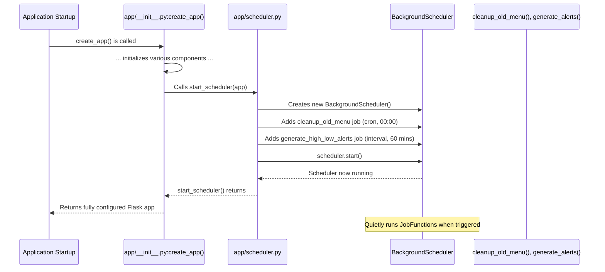

# Chapter 8: Automated Scheduling (BackgroundScheduler)

In [Chapter 7: Role-Based Blueprints](07_role_based_blueprints_.md), we learned how `ManageIt` keeps its different sections organized for various users like students, mess officials, and admins. Our application is now structured, secure, handles data well, and is fast!

But what about tasks that need to happen regularly, all by themselves, without anyone having to click a button?
Imagine the mess system:
*   Old menu items need to be removed from the database every day so it doesn't get too cluttered.
*   The system should automatically check for "high waste" or "low feedback" and create alerts.
*   Daily reports might need to be sent out.

If someone had to manually do these tasks every day, they might forget, or it would take up valuable time. This is where **Automated Scheduling** comes in handy!

Think of it like a **reliable alarm clock** or a **factory automation system**. You set up instructions once (e.g., "clean up at midnight," "check alerts every hour"), and the system automatically triggers these specific jobs at the predefined times. This ensures all the important maintenance and critical processes happen consistently in the background, keeping the system running smoothly without human intervention.

## What is Automated Scheduling (BackgroundScheduler)?

**Automated Scheduling** is a system that allows `ManageIt` to run tasks automatically at specific times or regular intervals. It uses a special tool called `BackgroundScheduler`.

The `BackgroundScheduler` is like a diligent assistant who:
*   **Watches the clock**: It constantly monitors the time.
*   **Knows its tasks**: It has a list of jobs it needs to perform.
*   **Triggers jobs**: When the clock hits a predefined time or interval, it quietly runs the specified task in the background.

Because it runs in the "background," it doesn't interfere with users actively using the application or slow down the web pages.

## Our Use Case: Cleaning Up Old Data Automatically

One of the most important background tasks for `ManageIt` is to keep its database tidy. The system stores daily menus, non-veg items, and other temporary data. Over time, this data becomes old and unnecessary.

**Problem:** If we never remove old data, the database will keep growing, becoming slower and consuming more storage.

**Solution:** We can schedule a **daily cleanup job** to automatically delete old menu entries and other temporary records. This ensures our database remains efficient and fast without anyone having to remember to do it manually.

## Key Concepts for Beginners

To understand how `ManageIt` uses `BackgroundScheduler`, let's break down a few key ideas:

### 1. Scheduler

This is the main engine that manages all our automated tasks. It's the "master clock" or the "task manager" that knows *what* jobs to run and *when*.

*   **Analogy**: A conductor in an orchestra. The conductor (scheduler) doesn't play the music (do the job) itself, but it tells each musician (job) exactly *when* to play.

### 2. Job

A job is a specific Python function that `ManageIt` wants to run automatically. It contains the actual code to perform a task.

*   **Analogy**: A sheet of music for a specific instrument. It contains the instructions for what that musician (job) needs to play.

### 3. Trigger

A trigger tells the scheduler *when* a job should be executed. There are different types of triggers:

| Trigger Type | Description                                                      | Analogy                                   | Example for `ManageIt`                                  |
| :----------- | :--------------------------------------------------------------- | :---------------------------------------- | :------------------------------------------------------ |
| `cron`       | Runs at specific times, like a classic Unix cron job (e.g., "every day at midnight"). | A daily alarm clock set for a precise time. | "Delete old menu data every day at 00:00 (midnight)."   |
| `interval`   | Runs repeatedly after a fixed duration (e.g., "every 30 minutes"). | A kitchen timer that goes off every 30 minutes. | "Check for high waste/low feedback alerts every 60 minutes." |

### 4. Background

The "BackgroundScheduler" runs its tasks in the background, which means it doesn't block the main application from doing its job (like serving web pages). It runs silently, in parallel with everything else.

*   **Analogy**: A janitor who cleans the school building at night or during off-hours. They do their work without interrupting classes or student activities.

## How `ManageIt` Uses Automated Scheduling

In `ManageIt`, all our scheduled jobs are defined in `app/scheduler.py`. The [Flask Application Factory](02_flask_application_factory_.md) (the `create_app` function) then tells the scheduler to start running these jobs when the application begins.

Let's see how our "cleanup old data" use case is implemented.

### Step 1: Defining the Cleanup Job

We have a Python function in `app/scheduler.py` that contains the logic to delete old menu items.

```python
# app/scheduler.py (simplified)
import logging
from app.models.database import DatabaseManager # Our database helper!
from app.utils.time_utils import get_fixed_time

def cleanup_old_menu():
    """Deletes old menu and non-veg items once a day."""
    logging.info("Starting cleanup_old_menu job...")
    try:
        current_date = get_fixed_time().date() # Get today's date
        
        # Use our DatabaseManager to safely connect and execute queries
        with DatabaseManager.get_db_cursor() as (cursor, connection):
            # Delete records from 'temporary_menu' older than today
            cursor.execute("DELETE FROM temporary_menu WHERE created_at < %s", (current_date,))
            # Delete non-veg main entries older than today
            cursor.execute("DELETE FROM non_veg_menu_main WHERE menu_date < %s", (current_date,))
            connection.commit() # Save changes to the database

        logging.info(f"✅ Old menu data cleaned before {current_date}")
    except Exception as e:
        logging.error(f"Error cleaning old menu data: {e}")
```
**Explanation:**
*   `cleanup_old_menu()` is our **job** function.
*   It uses `get_fixed_time().date()` to determine "today" in the correct timezone.
*   It then uses the `DatabaseManager` (from [Chapter 3: Database Management (DatabaseManager)](03_database_management__databasemanager__.md)) to run `DELETE` commands, removing any data that was created *before* today. This keeps the database fresh!

### Step 2: Scheduling the Job to Run Daily (using `cron` trigger)

Now, we tell the `BackgroundScheduler` to run our `cleanup_old_menu` job every day at midnight. This is done in the `start_scheduler` function.

```python
# app/scheduler.py (simplified)
from apscheduler.schedulers.background import BackgroundScheduler
import pytz # For handling time zones
# ... (cleanup_old_menu and other job functions are defined above) ...

def start_scheduler(app):
    """Initializes and starts the BackgroundScheduler."""
    ist = pytz.timezone("Asia/Kolkata") # Set timezone to Indian Standard Time
    scheduler = BackgroundScheduler(timezone=ist) # Create our scheduler
    app.logger.info("Initializing BackgroundScheduler...")

    # Add the cleanup job: runs daily at midnight (00:00) IST
    scheduler.add_job(
        func=cleanup_old_menu,  # This is the job function to run
        trigger="cron",         # Use the 'cron' trigger type
        hour=0, minute=0,       # Run at 0 hours, 0 minutes (midnight)
        timezone=ist            # Ensure it runs in IST
    )
    app.logger.info("Scheduled cleanup job for daily midnight IST.")

    scheduler.start() # Start the scheduler! It will now run quietly in the background.
    app.logger.info("✅ Background scheduler started.")
```
**Explanation:**
*   `scheduler = BackgroundScheduler(timezone=ist)` creates the scheduler and tells it to operate in Indian Standard Time (IST).
*   `scheduler.add_job(...)` adds our `cleanup_old_menu` function as a job.
*   `trigger="cron", hour=0, minute=0` specifies that this job should run at 00:00 (midnight) every day.
*   `scheduler.start()` kicks off the entire scheduling system. From this point on, the cleanup job will automatically run every night!

### Another Use Case: Generating High/Low Alerts (using `interval` trigger)

Some tasks don't need to run at a specific time but rather repeatedly throughout the day. For example, `ManageIt` needs to periodically check for high waste levels or low feedback ratings to notify mess officials.

```python
# app/scheduler.py (simplified)
# ... imports ...
# ... cleanup_old_menu function ...

high_low_alerts_cache = {} # A temporary place to store generated alerts

def generate_high_low_alerts():
    """Generates high waste and low feedback alerts for each mess."""
    logging.info("Starting generate_high_low_alerts job...")
    mess_list = ["mess1", "mess2"]
    for mess_name in mess_list:
        alerts = []
        try:
            with DatabaseManager.get_db_cursor() as (cursor, connection):
                # Example: Find floors with high total waste in the last 7 days
                cursor.execute("""
                    SELECT floor, SUM(total_waste) FROM waste_summary
                    WHERE waste_date >= %s - INTERVAL 7 DAY AND mess_name = %s
                    GROUP BY floor HAVING SUM(total_waste) > 50
                """, (get_fixed_time().date(), mess_name))
                for floor, waste_amount in cursor.fetchall():
                    alerts.append(f"⚠️ High waste: {waste_amount} Kg on {floor} floor.")
                
                # Example: Find meals with low average feedback ratings in the last 7 days
                cursor.execute("""
                    SELECT AVG(rating), meal FROM feedback_summary
                    WHERE mess = %s AND feedback_date >= %s - INTERVAL 7 DAY
                    GROUP BY meal HAVING AVG(rating) < 3.0
                """, (mess_name, get_fixed_time().date()))
                for avg_rating, meal_type in cursor.fetchall():
                    alerts.append(f"❗ Low feedback: Avg {round(avg_rating, 2)} for {meal_type}.")
            
            high_low_alerts_cache[mess_name] = alerts # Store alerts for the mess
            logging.info(f"Generated {len(alerts)} alerts for {mess_name}.")
        except Exception as e:
            logging.error(f"Error generating alerts for {mess_name}: {e}")

# ... (start_scheduler function continued) ...
```
**Explanation:**
*   `generate_high_low_alerts()` is another **job** function.
*   It performs database queries to find specific conditions (high waste, low feedback) for each mess.
*   The results are stored in `high_low_alerts_cache`, which can then be accessed by the `mess_bp` (from [Chapter 7: Role-Based Blueprints](07_role_based_blueprints_.md)) to display on the mess official's dashboard.

Now, let's add this job to our scheduler using an `interval` trigger:

```python
# app/scheduler.py (simplified - start_scheduler function continued)
# ... (imports, cleanup_old_menu, generate_high_low_alerts functions) ...

def start_scheduler(app):
    """Initializes and starts the BackgroundScheduler."""
    ist = pytz.timezone("Asia/Kolkata")
    scheduler = BackgroundScheduler(timezone=ist)
    app.logger.info("Initializing BackgroundScheduler...")

    # Add the cleanup job (as before)
    scheduler.add_job(func=cleanup_old_menu, trigger="cron", hour=0, minute=0, timezone=ist)
    app.logger.info("Scheduled cleanup job for daily midnight IST.")

    # Add the alerts job: runs every 60 minutes
    scheduler.add_job(
        func=generate_high_low_alerts, # This is the job function to run
        trigger="interval",            # Use the 'interval' trigger type
        minutes=60,                    # Run every 60 minutes
        timezone=ist
    )
    app.logger.info("Scheduled high/low alerts job every 60 minutes IST.")

    scheduler.start()
    app.logger.info("✅ Background scheduler started.")
```
**Explanation:**
*   `scheduler.add_job(func=generate_high_low_alerts, trigger="interval", minutes=60)` tells the scheduler to run `generate_high_low_alerts` every 60 minutes.

## Under the Hood: How `ManageIt` Starts and Manages Schedules

Let's see how our `create_app` factory function (from [Chapter 2: Flask Application Factory](02_flask_application_factory_.md)) connects everything to start the scheduler.

### The Scheduler Startup Process



This diagram shows that the `create_app` factory is the starting point. It calls `start_scheduler` which then sets up and launches the `BackgroundScheduler`. Once started, the scheduler operates independently, running jobs at their specified times.

### Integrating with the Flask Application Factory (`app/__init__.py`)

The `app/__init__.py` file (our application factory) is responsible for calling `start_scheduler()` when the `ManageIt` application starts up.

```python
# app/__init__.py (simplified)
from flask import Flask
from app.scheduler import start_scheduler # Import our scheduler starter!

def create_app(config_name=None):
    app = Flask(__name__)
    # ... (app configuration, extensions, blueprints, database initialization) ...

    # Scheduler setup: This is where we kick off the background tasks
    try:
        # Calls the function that sets up and starts all our background jobs
        start_scheduler(app)
        app.logger.info("Scheduler started successfully.")
    except Exception as e:
        app.logger.error(f"Error starting scheduler: {e}")
        # If the scheduler fails to start, it's a critical issue, so we re-raise the error.
        raise 

    app.logger.info(f"Flask application created with {config_name} configuration")
    return app
```
**Explanation:**
*   `from app.scheduler import start_scheduler` imports our function that sets up the scheduler.
*   `start_scheduler(app)` is called. The `app` object is passed because some scheduled jobs (like `send_admin_notification_job` which is not fully detailed here for brevity) might need access to Flask's configuration or logger within the application context. This is crucial for jobs that interact with other parts of our Flask application.

### A Job That Needs the Application Context

Sometimes, a job might need to do things that require access to the Flask application's settings or services, like logging with `app.logger` or interacting with a database that relies on `app.config`. For these jobs, we make sure to wrap their execution within `app.app_context()`.

```python
# app/scheduler.py (simplified)
# ... imports ...
from flask import current_app # To access Flask's app context within a job
from app.services.notification_service import NotificationService # Example service

def send_admin_notification_job(app):
    """Generates and sends admin notifications (e.g., critical feedback)."""
    logging.info("Starting send_admin_notification_job...")
    
    # This block temporarily "activates" the Flask application context.
    # It allows the code inside to access app.config, app.logger, etc.
    with app.app_context(): 
        try:
            # Example: Use a Service Layer function to get critical feedback
            # The NotificationService might use DatabaseManager, which needs app.config
            messages = NotificationService.create_critical_feedback_notifications() # Dummy: "Feedback is low!"

            if messages:
                # Store notifications in DB or send emails
                for msg in messages:
                    NotificationService.send_notification(msg, 'admin')
                app.logger.info(f"Sent {len(messages)} admin notifications.")
            else:
                app.logger.info("No critical feedback to notify today.")
        except Exception as e:
            app.logger.error(f"Error sending admin notifications in scheduler: {e}")

# ... (start_scheduler function, showing how to add this job) ...
    # Example: Schedule admin notification to run after each meal
    def job_wrapper_for_app_context(meal_name):
        send_admin_notification_job(app) # The 'app' object is passed from start_scheduler

    scheduler.add_job(
        func=job_wrapper_for_app_context,
        trigger="cron",
        hour=14, minute=0, # Example: 2 PM for lunch
        id="notify_lunch_admin",
        args=["Lunch"], # Arguments for the job_wrapper, if any
        timezone=ist
    )
    app.logger.info("Scheduled admin notification for Lunch feedback at 14:00 IST.")
```
**Explanation:**
*   `send_admin_notification_job(app)` receives the Flask `app` object when scheduled.
*   `with app.app_context():` is used inside the job. This is like telling Flask, "For this small block of code, pretend we are handling a web request, so you can give me access to `current_app` (which is our `app` object) and its configurations."
*   This allows the job to safely interact with other parts of the application, like using `NotificationService` (which itself might depend on `DatabaseManager` and `app.config`).

## Conclusion

**Automated Scheduling (BackgroundScheduler)** is an essential component for any modern application, and `ManageIt` uses it to great effect. By defining and scheduling jobs with `cron` and `interval` triggers, `ManageIt` can reliably perform important tasks like cleaning up old data, generating alerts, and sending notifications, all automatically in the background. This automation ensures the application remains efficient, up-to-date, and proactive, freeing up users from manual maintenance and allowing them to focus on what matters most.

---

<sub><sup>**References**: [[1]](https://github.com/blackpanther093/manage/blob/532c55abf37f53d789a7f0214d35dbff08c6fa09/app/__init__.py), [[2]](https://github.com/blackpanther093/manage/blob/532c55abf37f53d789a7f0214d35dbff08c6fa09/app/blueprints/mess.py), [[3]](https://github.com/blackpanther093/manage/blob/532c55abf37f53d789a7f0214d35dbff08c6fa09/app/scheduler.py), [[4]](https://github.com/blackpanther093/manage/blob/532c55abf37f53d789a7f0214d35dbff08c6fa09/app/services/notification_service.py)</sup></sub>