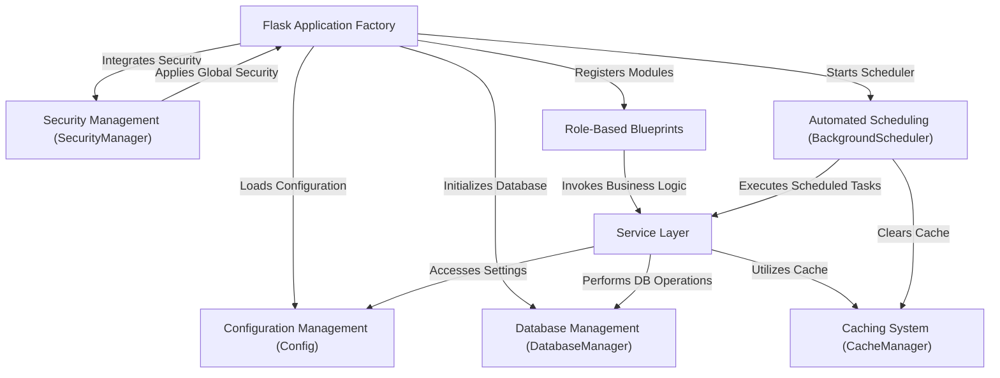

# Tutorial: manage

ManageIt is a **robust mess management system** built with Flask, designed to *streamline operations* for educational institutions. It provides **multi-role dashboards** for students, mess staff, and administrators, offering features like menu management, payment processing, feedback, and waste tracking, all while ensuring *security and efficient performance*.

## Visual Overview

## Chapters

1. [Configuration Management (Config)
](01_configuration_management__config__.md)
2. [Flask Application Factory
](02_flask_application_factory_.md)
3. [Database Management (DatabaseManager)
](03_database_management__databasemanager__.md)
4. [Security Management (SecurityManager)
](04_security_management__securitymanager__.md)
5. [Service Layer
](05_service_layer_.md)
6. [Caching System (CacheManager)
](06_caching_system__cachemanager__.md)
7. [Role-Based Blueprints
](07_role_based_blueprints_.md)
8. [Automated Scheduling (BackgroundScheduler)
](08_automated_scheduling__backgroundscheduler__.md)

---
